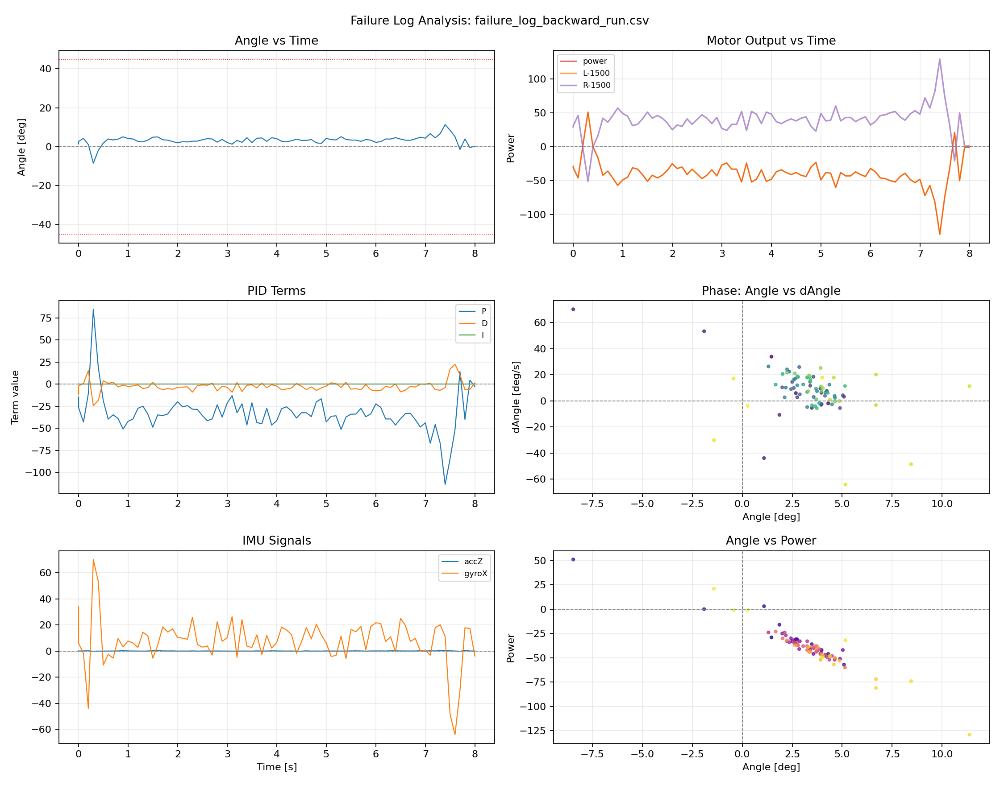
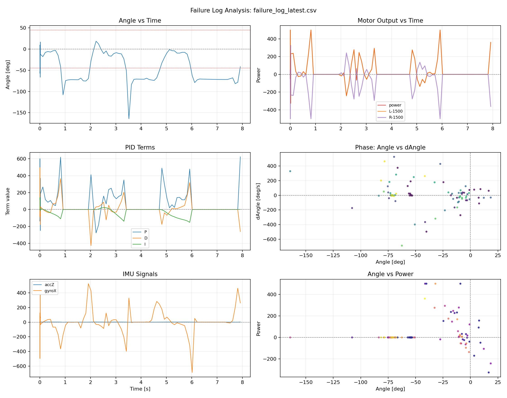
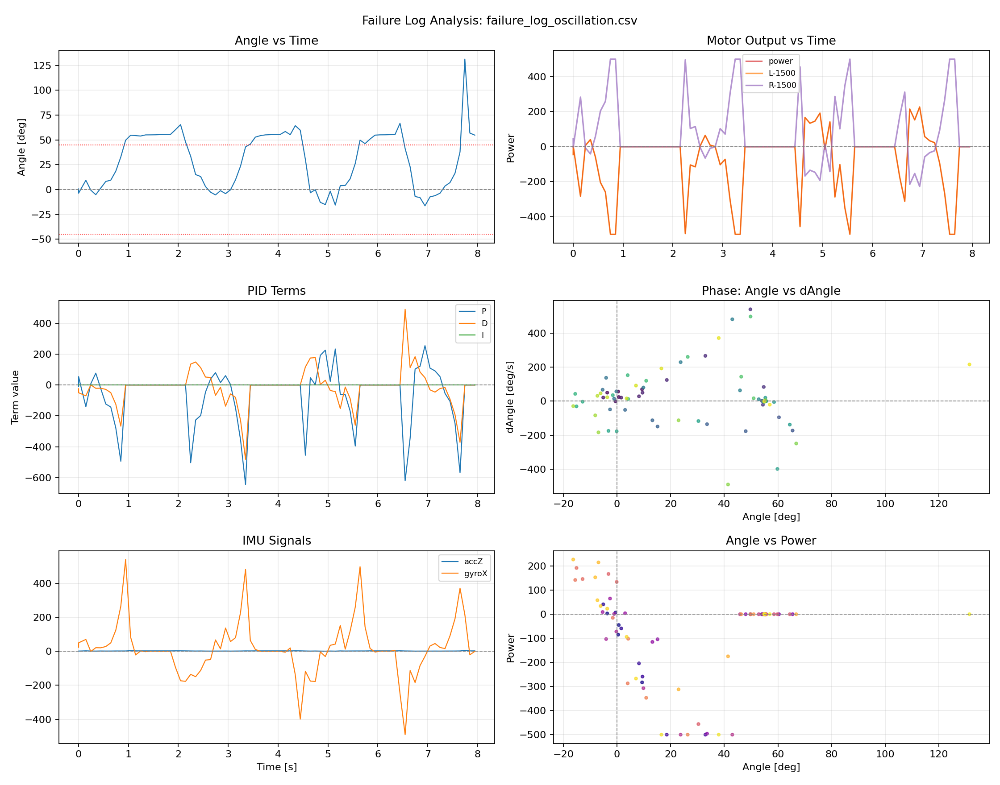

# 進捗ログ・実験ログ — Progress Log

> このファイルは README.md から切り出された詳細な実験記録です。
> M5StickC Plus2 倒立振子プロジェクトを 2026-04-13 から 2026-05-02 まで日々進めた、半田付け→ファーム移植→ハードウェアトラブル→IMU軸特定→PIDチューニング→GitHub Pages デモ化…までの試行錯誤の記録。
>
> This file is the detailed experiment log extracted from README.md.
> A daily record of the M5StickC Plus2 inverted pendulum project from 2026-04-13 to 2026-05-02 — soldering → firmware port → hardware troubles → IMU axis identification → PID tuning → GitHub Pages demo, etc.
>
> 📖 [README に戻る / Back to README](../README.md)
>
> 🇯🇵 [日本語](#japanese) ・ 🇬🇧 [English](#english)

---

<a id="japanese"></a>
## 日本語

### 2026-04-13: 半田付け完了・サーボ動作確認

- キット基板へのサーボ半田付けを完了
- サーボ動作テスト (`servo_test.ino`) およびピン自動スキャン診断を実施
- 配線修正後、サーボの動作を確認 ✅
- 再半田付け中に M5StickC Plus が過熱・故障 → 基板ショートによる損傷の可能性大
- USB 接続するだけで発熱し画面表示なし、復旧不可と判断 → **M5StickC Plus 交換待ち**

### 2026-04-16: M5StickC Plus2 で復活・ファームウェア移植完了

- M5StickC Plus の代替として **M5StickC Plus2** を入手
- Plus → Plus2 の移植で判明した差異と解決策を以下にまとめる（⚠️ 同じキットで Plus2 を使う人向け）

#### Plus → Plus2 移植時のトラブルと対策

| # | 問題 | 原因 | 対策 |
|---|------|------|------|
| 1 | **画面が表示されない** | `M5.begin()` + `M5.Lcd` は Plus 専用。Plus2 では API が異なる | `M5StickCPlus2.h` をインクルードし、`StickCP2.begin(cfg)` + `StickCP2.Display` を使用 |
| 2 | **サーボが回らない（PWM出力はOK）** | Plus2 はデフォルトで5V外部出力が無効。HATコネクタから5Vが出ていなかった | `auto cfg = M5.config(); cfg.output_power = true;` で5V出力を有効化 |
| 3 | **ボタンを押しても制御が止まらない** | Plus の `M5.BtnA.wasPressed()` / `wasClicked()` が Plus2 で期待通りに動作しない | `StickCP2.BtnA.wasReleased()` を使用（ボタンを離した瞬間にトグル） |
| 4 | **IDLEに切り替わるがモーターが止まらない** | `servo.write(90)` だけでは FS90R が完全停止しないことがある（PWM信号が残る） | `servo.detach()` でPWM信号を完全切断。再開時に `servo.attach()` で再接続 |
| 5 | **G0 に繋いだサーボが動かない** | Plus2 では HATコネクタが 8ピン→18ピンに変更され、G0 のピン位置が異なる | サーボピンを G0 → **G25** に変更（`SERVO1_PIN 25`） |
| 6 | **片方のサーボだけ回らない / 回転速度が左右で大きく異なる** | FS90R の個体差でニュートラル点（停止位置）が `write(90)` からずれている。今回の個体は停止点が約75°付近にあり、小さい制御出力だと停止域に入って回らなかった | `SERVO2_TRIM = -15` でニュートラル補正。`servo.write(90 + TRIM - cmd)` で停止点を調整。正しい値は個体ごとに異なるため、IDLE状態でサーボが静止する値を探して設定する |

#### Plus と Plus2 のハードウェア・API 対応表

| 項目 | M5StickC Plus | M5StickC Plus2 |
|------|--------------|----------------|
| 電源IC | AXP192 | AXP2101 |
| ライブラリ | `M5StickCPlus.h` | `M5StickCPlus2.h` |
| 初期化 | `M5.begin()` | `auto cfg = M5.config(); StickCP2.begin(cfg);` |
| 画面 | `M5.Lcd` | `StickCP2.Display` |
| IMU | `M5.Imu.getGyroData(&gx,&gy,&gz)` | `auto d = StickCP2.Imu.getImuData(); d.gyro.x` |
| バッテリー | `M5.Axp.GetBatVoltage()` | `StickCP2.Power.getBatteryLevel()` |
| 5V出力 | `M5.Axp.SetLDO2(true)` | `cfg.output_power = true` |
| ボタン | `M5.BtnA` / `M5.BtnB` | `StickCP2.BtnA` / `StickCP2.BtnB` |
| FQBN | `m5stack_stickc_plus` | `m5stack_stickc_plus2` |
| HATコネクタ | 8ピン | 18ピン（ピン配置変更） |

- サーボ動作テスト (`servo_test.ino`) → G26 で回転確認 ✅
- メインファームウェア (`inverted_pendulum.ino`) → Plus2 対応に移植、書き込み完了 ✅
- ボタン操作（Aボタンでスタート/ストップ）動作確認 ✅
- **次のステップ**: サーボ2本接続して倒立テスト

### 2026-04-16: 息抜き — GitHub ステッカースライドショー 🐙

倒立制御のデバッグの合間に、M5StickC Plus2 の画面に GitHub ステッカーを表示するスケッチを作成。Aボタンで Octocat → Copilot → Duck → Mascot を切り替え表示できる。

- PNG/GIF 画像を Python（Pillow）で 110×110 に縮小し、RGB565 ビットマップに変換
- **バイトオーダーの罠**: M5GFX（LovyanGFX）の `pushImage` はビッグエンディアン順の RGB565 を期待する。ESP32 はリトルエンディアンなので、各ピクセルの上位・下位バイトをスワップしないと色が崩れる
- スケッチ: `octocat_display/octocat_display.ino`

### 2026-04-18: 完全やり直し — pulse_drive 方式で両輪駆動成功 🎉

前回（4/16）の試行錯誤を踏まえ、ゼロからやり直し。n_shinichi氏のオリジナル実装を調査した結果、**ESP32Servo ライブラリが根本原因**と判明。手動パルス生成（`pulse_drive`）方式に全面書き換えし、**G0 + G26 の両サーボが同じ勢いで安定駆動に成功**。

<!-- YouTube: 両輪サーボ駆動テスト -->
[](https://www.youtube.com/watch?v=syauXEm0TFY)

#### 判明した追加の問題と対策

| # | 問題 | 原因 | 対策 |
|---|------|------|------|
| 7 | **両サーボ接続時に片方だけ遅い** | `pulse_drive` が OFF のサーボにも1500μsパルスを出し続けていた。個体差でニュートラルがずれているサーボが微回転し、電流を消費して他方に影響 | OFF のサーボにはパルスを一切出さない（`digitalWrite(pin, LOW)` のまま）。`servo_stop()` もパルスなしに変更 |
| 8 | **ボタンが反応しない** | `digitalRead(BTN_A)` のチェックが1秒に1回のループ内にあり、タイミングが合わないと検出できなかった | ボタン処理を100msループに移動 + 300msデバウンス追加 |

#### 技術的な学び

- **ESP32Servo vs pulse_drive**: `servo.attach()` は LEDC チャネルを占有し G0 のブート問題を起こす。`digitalWrite` による手動パルスなら G0 も安全に使える
- **マイクロ秒制御**: `servo.write(90)` の角度指定ではなく、1500μs = 停止、500-2500μs = 速度制御のμsベースが正確
- **パルス制御の副作用**: 停止のつもりで1500μsパルスを出し続けると、ニュートラルずれのあるサーボが微回転する。完全停止にはパルスを止める必要がある

### 2026-04-18: 方向制御の確立 — IMU軸の特定と全制御系の完成 🎯

前日の pulse_drive 成功に続き、PID制御の方向を正しく設定。**多くの試行錯誤**の末、全制御系が正しく動作するに至った。

#### 解決した問題と得られた知見

| # | 問題 | 原因 | 対策 |
|---|------|------|------|
| 9 | **ONにしてもモーターが動かない** | `PITCH_OFFSET=81.0` の定数が残っていて Angle が常に大きな値 → ANGLE_LIMIT 超過で PID が動かない | PITCH_OFFSET 定数を削除。ON にした瞬間の Pitch を基準値として自動設定 |
| 10 | **ボタンが反応しない** | `digitalRead(BTN_A)` が1秒ループ内にあり、タイミング不一致 | 100ms ループに移動 + 300ms デバウンス |
| 11 | **数秒でOFFになる** | ANGLE_LIMIT 超過時に `motor_sw=0` にリセットしていた | PID リセットのみ行い、motor_sw は ON のまま維持 |
| 12 | **前後どちらに傾けても同じ方向に進む** | `atan2(acc[1], acc[2])` が直立付近（90°付近）では前後の傾きに対して同符号を返す。Plus2 の IMU 取り付け向きでは Y/Z 軸ではなく **Z 軸が前後の傾き方向** | IMU 軸確認ツールで実機テスト → **Z 軸が前後傾き**と特定。`getPitch()` を `asin(-acc[2])` に変更 |
| 13 | **モーター方向がスピンする** | サーボの取り付け向きが不明で、`+power/+power`、`-power/-power`、`+power/-power`、`-power/+power` の4パターンが未確定 | 4パターン方向テストスケッチで実機確認 → **`+power/-power` が前進**と確定 |

#### IMU 軸の特定手順（再現可能な方法）

1. IMU軸確認スケッチ（`motor_dir_test.ino`）を書き込む — 画面に X/Y/Z の加速度をリアルタイム表示
2. ロボットを直立させて各軸の値を確認
3. **前に傾ける** → どの軸が変化するか記録
4. **後ろに傾ける** → 同じ軸が逆符号に変化するか確認
5. その軸を `getPitch()` で使用

本プロジェクトの M5StickC Plus2 では：
- **X 軸**: 変化しない（左右方向）
- **Y 軸**: 少し変化（重力方向）
- **Z 軸**: 大きく変化（**前後方向** — 前=マイナス、後ろ=プラス）

#### 確定した制御パラメータ

```
モーターピン: G0 (左), G26 (右)
モーター方向: powerL = +power, powerR = -power
IMU角度: getPitch() = asin(-acc[2])
ジャイロ: -gyro[2]（Z軸）
電源: BAT端子からサーボ給電
```

- 前後応答テスト → **前に傾けたら前、後ろに傾けたら後ろに移動** ✅
- **次のステップ**: PIDチューニング（kp → kd → ki の順に手動調整）

### 2026-04-18: 42パターン自動PIDスイープ + ヒートマップ可視化

- `tools/auto_tune.py` で kp × kd のグリッドサーチ（42組み合わせ）を自動実行
- 各パラメータ組で10秒間バランスを試み、安定時間と平均角度を記録
- 結果を `tools/data/autotune_heatmap.png` にヒートマップ可視化
- **発見**: USB ケーブルのテンション（張力）がバランスを大幅に補助していた
  - USB 接続時: 5秒以上安定
  - USB 切断時: 即座に転倒
- 単純なPIDゲイン調整だけでは不十分、ファームウェア構造自体の見直しが必要と判断

### 2026-04-25: n_shinichi氏コード完全準拠 — クリーンリライト + IMU軸修正 🔧

n_shinichi氏のオリジナルコードと自分のコードを徹底比較し、**10個の差異**を特定。クリーンリライトを実施。

#### 発見された重大な問題

| # | 問題 | 原因 | 対策 |
|---|------|------|------|
| 14 | **カルマンフィルタのジャイロ軸が間違っていた** | `gyro[2]`（Z軸）を使用していたが、Plus2では**X軸 (`gyro[0]`)が前後回転軸**だった。ジャイロ軸ビューアーで確認 | `gyro[0]` に変更。**最も影響の大きかった修正** |
| 15 | **getPitch() の atan2 境界問題** | `atan2(-acc[2], -acc[1])` では直立位置が -90°（atan2 の ±90° 境界付近）にあり、前後どちらに傾けても同符号の角度が返る | `atan2(-acc[1], acc[2])` に変更。直立 = 0° で ±90° 境界から遠い安定領域に移動 |
| 16 | **Pitch_offset が動的だった** | ON にした瞬間の Pitch_filter を保存する方式。タイミングで値が変わり不安定 | n_shinichi氏に準拠し固定値に変更 |
| 17 | **ANGLE_LIMIT の判定が間違った変数** | Pitch_filter（オフセット込み）をチェックしていて、Angle（オフセット差引後）をチェックしていなかった | `Angle` で判定するように修正 |

#### atan2 境界問題の詳細（重要な教訓）

Plus2 のIMUでは直立時の加速度値が `acc[1]≈0, acc[2]≈1` で、以下のように atan2 の引数によって結果が大きく異なる：

```
            直立時の値     前傾5°    後傾5°     問題
atan2(-acc[2], -acc[1])  -89.8°    -95.7°    -84.3°    ← 直立が±90°境界！大傾斜で符号反転
atan2(acc[1], acc[2])      0.0°     +5.7°     -5.7°    ← 符号は正しいがジャイロと逆向き
atan2(-acc[1], acc[2])     0.0°     -5.7°     +5.7°    ← ✅ 直立=0°, 符号・ジャイロ一致
```

**結論**: IMU軸の向きに合わせて、**直立位置が atan2 の 0° 付近**になる引数の組み合わせを選ぶこと。±90° 境界付近に直立があると、大きな傾斜で符号が反転して制御不能になる。

#### 小角度での制御成功データ（シリアルログ）

以下はUSB接続状態でのシリアルログ。**±2° 以内のマイクロバランス**が動作していることを確認：

```
Angle= +0.5  power=  -1    ← ほぼ直立、微調整
Angle= +1.4  power= -12
Angle= +0.8  power=  -3
Angle= +0.5  power= +12
Angle= +0.9  power= +10
Angle= +0.4  power= +19
Angle= +0.2  power=  +7
Angle= -0.2  power= +15    ← 後傾→前進で補正
Angle= +1.2  power= -42
Angle= +1.2  power= -16
Angle= +0.1  power=  -4
```

#### 現在の確定パラメータ

```
モーターピン: G0 (左), G26 (右)
モーター方向: powerL = +power, powerR = -power
角度算出: getPitch() = atan2(-acc[1], acc[2])  ← 直立=0°
カルマンフィルタ: gyro[0]（X軸）
dAngle: gyro[0] - gyroOffset[0]
PID符号: P=-kp*A, I+=-ki*A, D=-kd*dA（旧コードとの互換のため反転）
ANGLE_LIMIT: ±20°（atan2境界を回避）
PID: kp=6.3, ki=1.4, kd=0.48, kspd=5.0, kdst=0.14
Pitch_offset: 0.0（atan2版では直立≈0°）
```

#### 残タスク

- [ ] atan2(-acc[1], acc[2]) + ジャイロ符号の最終検証
- [ ] USB切断状態でのバランステスト
- [ ] PID微調整（auto_tune.py + ヒートマップ）
- [ ] CERN ROOT による時系列データ可視化

### 2026-05-01: 前後符号の再検証と「後ろへ逃げる」問題のログ化

4/30深夜〜5/1にかけて、前後の角度符号・PID・モーター出力を実機ログで再検証した。最終的に、**acc[2] の偏差を使う線形角度**で前後の符号が分かれることを確認した。

#### 今日わかったこと

| 項目 | 結論 |
|------|------|
| 角度軸 | `acc[2]` の変化が前後の分離に効く。`acc[1]` は前後どちらでも同方向に動く場面があり、単独では不安定 |
| 角度式 | 現在は `getPitch() = (acc[2] - 1.0) * 57.3`。物理角度そのものではないが、制御用の符号・偏差として利用 |
| ゼロ基準 | `on` / AボタンON時に `Pitch_offset = Pitch_filter` として、今の姿勢を自動で `Angle=0` にする |
| 詳細ログ | `X,...` 行を追加し、`Angle,dAngle,P,I,D,Speed,power,L/R,acc,gyro` をCSV保存できるようにした |
| I項・速度項 | `ki=0` でも `kspd/kpower` を入れると激しく振動しやすい。現時点ではOFF |
| 最低出力 | `minp=80` はFS90R不感帯対策として試したが、段差的に効いて振動源になりやすい。現時点ではOFF |
| 前後非対称 | 後ろへ逃げやすいため、`pneg`（後退補正）を前進側より強くする方向は効果あり |

#### 保存した転倒ログ

以下のCSVは、次回の解析用に保存した。

```
tools/data/failure_log_latest.csv        # ki=0 でも kdst/kspd が残って走り込みを増幅したログ
tools/data/failure_log_oscillation.csv   # D項・出力飽和が強く、小刻み振動→ANGLE_LIMIT超過したログ
tools/data/failure_log_backward_run.csv  # 後ろへ逃げるが、飽和は少なく補正不足寄りだったログ
```

#### 転倒ログの可視化（PNG表示）

`tools/visualize_root.py` を詳細ログ形式に対応させ、各ログからPNGを生成した。READMEではクリックしなくても見えるように、PNG画像を横幅いっぱいに表示する。

```
python3 tools/visualize_root.py tools/data/failure_log_*.csv
```

##### 後ろへ逃げるログ

`failure_log_backward_run.csv`

Angle は小さい範囲に留まる一方、power が負側に偏り続ける。補正方向は合っているが、後退方向の補正不足またはサーボ低速域の効き不足が疑われる。

<p align="center">
  
</p>

##### kspd/kdst が残って走り込むログ

`failure_log_latest.csv`

`ki=0` でも速度・距離系が残り、走り込みを増幅していた時期のログ。

<p align="center">
  
</p>

##### 小刻み振動・飽和ログ

`failure_log_oscillation.csv`

D項・出力が強く、power が飽和してから Angle が ±45° を超え、制御停止する様子が見える。

<p align="center">
  
</p>

可視化パネルには以下を含める：

- Angle vs Time（±45°のANGLE_LIMIT線つき）
- Motor Output vs Time（`power`, `L-1500`, `R-1500`）
- PID Terms（P/I/D）
- Phase plot（Angle vs dAngle）
- IMU Signals（accZ / gyroX）
- Angle vs Power

`.root` ファイルも同じディレクトリに保存しているが、READMEでは見やすさ優先でPNGのみ表示する。

#### 現在のファームウェア設定（次回の出発点）

```
getPitch(): (acc[2] - 1.0) * 57.3
ON時: Pitch_offset = Pitch_filter（自動ゼロ合わせ）
ANGLE_LIMIT: ±45°

kp=10.0
ki=0.0
kd=0.35
kpower=0.0
kspd=0.0
kdst=0.0

power_limit=350
power_pos_scale=0.85   # +power = 前進補正
power_neg_scale=1.70   # -power = 後退補正
min_drive_power=0      # 最低出力補正OFF
targetBias=0.0
```

#### 実機での観察

- 設定によっては **3〜4秒程度立つ** ところまで改善。
- ただし安定点には入らず、少し振動しながら、ある傾きから前または後ろへ走りながら倒れる。
- 後ろへ逃げる傾向が比較的多い。
- `kspd=1.2` や `minp=80` など段差・速度系を入れると激しい振動が増えた。
- `pneg=1.70` は立つ時間を伸ばしたが、完全には止まらない。

#### 次回の候補

1. `failure_log_backward_run.csv` を可視化し、後ろへ逃げる直前の `Angle/dAngle/P/D/power` の位相を確認する。
2. `pneg` を大きくする前に、`power_neg_scale` ではなく **後退側だけの小さな `bias`** または **左右/前後のサーボオフセット**を試す。
3. `gyro[0]` のD項ではなく、`Angle` の差分から作る `dAngle` 比較モードを追加し、D項の位相ズレを確認する。
4. `fil_N=5` の遅れを疑い、`fil_N=3` をログ付きで比較する。
5. 自動PIDスイープは、現在の「線形 `acc[2]` + 自動ゼロ合わせ + 前後非対称補正」を基準にやり直す。

### 2026-05-02: チューニングUIの解析強化・ブート演出・GitHub Pagesデモ・どこでも起動

実機のハードはそのままで、**ソフト側を一気に整えた日**。前半はチューニングUIの解析機能と演出、後半は持ち運び対応とウェブデモ化。

#### 1. チューニングUIの統計解析強化（STATS LAB）

> 「期待姿勢が緑（|∠|≤5°）を保つための最適なパラメータの特定」を統計的に出せるようにしたい、という要件。

- **GREEN ZONE バナー** — 全解析結果のサマリにベスト構成を抽出表示
- **STATS LAB パネル** — 2D ヒストグラム / 3D ヒストグラム / KP×KD 散布図 / 複数パラメータ組合せ解析
- **エラーバー / 信頼区間**入りのパラメータ感度プロット
- **score（0〜100）** を新設：
  - `duration·3`（最大30）+ `green%·50`（最大50）+ `max(0, 20−mean|∠|·2)`（最大20）
  - 1テスト1スコア。緑帯滞在時間 + 倒れない時間 + 振れ幅の小ささを統合
- **`⇅ APPLY` ボタン**：過去の好スコア構成のパラメータを **ワンクリックで実機に再投入**（`/api/c?q=k=v` を順に push）
- セッション一覧を `score` 降順で並べてベスト設定が一目でわかる

#### 2. マスコット演出とi18n

| マスコット | 役割 |
|---|---|
| **Mona**（GIF） | リアルタイムATTITUDE表示。安定時はゆったり、転倒の瞬間に高速アニメ。`+/-` の角度に合わせて顔の向きが追従 |
| **Copilot**（GIF） | 解析画面遷移時のヒーロー演出 |
| **Ducky**（GIF） | 言語切替時に画面中央に大きく登場（モード切替の明示） / 通信ロスト時の見守りバナー |

> 途中で「倒れた時のDuckyは要らない」というフィードバックがあり、PWM飽和バッジ・QUICK FALLトースト・診断パネルのリーダー切替など、**転倒に関わるDucky表示はすべて削除**。Duckyは「通信・モード切替」専用キャラに役割整理。

#### 3. ブート演出（SEED風スタートアップ診断）

最初のリロード時に**実プローブ付き**の診断シーケンスが流れるように。各行を1行ずつタイプ表示し、本物の `fetch` で確認して `[ OK ]` / `[ WARN ]` / `[ FAIL ]` を色分け表示：

```
[02:34:15.21] > HUD INTERFACE / DOM            ........ [ OK ]
[02:34:15.45] > NETWORK STACK                  ........ [ OK ]
[02:34:15.71] > TUNING SERVER · LOCAL API      ........ [ OK ]
[02:34:15.98] > WI-FI LINK · M5STICKC PLUS2    ........ [ OK ]   GATEWAY 192.168 · 200 OK
[02:34:16.21] > IMU · MPU6886 GYRO/ACCEL       ........ [ OK ]   ∠=0.42° · LIVE
...
◆ ALL SYSTEMS NOMINAL · LAUNCH
```

固定タイマーではなく**全プローブが完了するまで**閉じない。`WARN` があればアンバー、`FAIL` があれば赤バナーで2.2秒滞留。

#### 4. GitHub Pages デモ化（`docs/demo/`）

ハードを持っていない人にもUIを触ってもらえるように、Flaskなしで動く**完全静的版**をビルド。

- `tools/build_demo.py` で `tools/templates/index.html` から自動生成
- `window.IPS_DEMO = true` フラグを注入し、`fetch` をシムが横取り：
  - `GET /api/s` → シミュレートされた50Hzテレメトリ（PIDパラメータ反映つき）
  - `GET /api/c?q=k=v` → シム内の状態を実際に書き換え（スライダーがちゃんと効く）
  - `GET /api/sessions` → バンドルされた `data/sessions/index.json`
  - `GET /api/sessions/<id>` → 同 `data/sessions/<id>.json`
- 5本の合成セッション（`baseline / kp_too_high / better_kd / pneg_tuned / winner`）を内包し、score 13〜32 の比較が見える
- 左下に紫の **`DEMO MODE`** バッジで明示

#### 5. どこでも起動できるようにする — マルチSSID + APフォールバック

「オフィスに持って行ったとき、どうやって倒立振子を動かす？」への回答。**ファームに2層の安全網**を実装：

```cpp
// (B) 推奨: 複数SSIDを順に試す
#define IPS_WIFI_HAS_LIST
static const IpsWifiNet IPS_WIFI_LIST[] = {
  {"home_2g",       "home_password"},
  {"my_iphone_hot", "phone_password"},   // テザリング
  {"office_guest",  "office_password"},
};
// (どれも圏外なら自動でAPモード: SSID=IPS-CTRL  pass=ips12345)
```

- 起動時に **WiFiスキャン** → 視界にある既知SSIDのみ8秒ずつトライ → 全滅なら **自分自身がアクセスポイント**になり `http://192.168.4.1/` を開放
- LCD下段に **`<SSID> <IP>`** を常時表示。ブラウザで何を打てばいいか迷わない

5つの運用シナリオ（家／AP／スマホテザリング／GitHub Pages）は README §「🌍 持ち運び・遠隔運用」に表で整理。

#### 6. 通信まわりの技術解説（このプロジェクトでの実装）

> 上の機能を理解しておくと、自分で拡張しやすい。

##### (1) 制御UIとM5の通信モデル

```
ブラウザ ──HTTP──▶ Flask(tools/server.py) ──HTTP──▶ M5StickC Plus2
           50ms毎                            50ms毎
   /api/s, /api/c                       /s, /c
```

- **Flaskはただのプロキシ**。CORSやLAN/WiFi切替の差を吸収する薄い中継層。
  - 実装は `tools/server.py` の `requests.get(f"{M5_BASE}/s")` 一行だけ
  - `M5_URL` 環境変数で接続先IPを切替（家・AP・テザリングそれぞれ別IP）
- **M5側はESP32の `WebServer`**：`server.on("/s", handler)` 程度の最小実装で、ステータスJSONとコマンド文字列を返す
- **ポーリング**は50ms周期。WebSocket等のpushではなく単純な `setInterval(tick, 50)` で十分間に合う（人間の反応速度より速いし、ESP32側の処理負荷も小さい）

##### (2) WiFiの3モード — STA / AP / STA+AP

| モード | 役割 | このプロジェクトでの使いどころ |
|---|---|---|
| **STA**（Station） | 既存ルータの**子機**として参加。インターネットアクセス可、ブラウザ→M5は同一LAN必要 | 家・オフィスで普通に使う。`WiFi.begin(ssid, pass)` |
| **AP**（Access Point） | M5自身が**親機**になる。ルータ不要だがインターネットなし | フォールバック。社外プレゼンや電車内など、信用できないWiFi下で完全独立動作 |
| **STA+AP**（Hybrid） | 両方同時。STAでルータに繋ぎつつ、自分もAP（中継機のような動き） | このプロジェクトでは未使用。将来 mDNS応答+遠隔管理を一緒にやりたい時の選択肢 |

切替は `WiFi.mode(WIFI_STA / WIFI_AP / WIFI_AP_STA)`。本プロジェクトはまずSTAで全SSID試行 → 全敗時に `WIFI_AP` に切替 + `WiFi.softAP(SSID, PASS)` を実施。

##### (3) `WiFi.scanNetworks()` で「圏外なのに繋ぎに行く」を回避

`WiFi.begin()` は接続失敗時に8秒前後ブロックする。3つ並べると**最悪24秒待たされる**。先に `scanNetworks()` で電波が見えるSSIDだけに絞ると、家にいるときは1試行で即座に繋がる：

```cpp
int n = WiFi.scanNetworks();
for (each known ssid) {
  bool inRange = false;
  for (int j=0; j<n; j++) if (WiFi.SSID(j) == ssid) inRange = true;
  if (!inRange) continue;     // 電波がない → スキップ
  if (tryConnect(ssid, pass, 8000)) break;
}
```

##### (4) ソフトAPモードの仕様（ESP32）

- パスワードは **8文字以上必須**（短いと `softAP()` が `false` を返す）
- デフォルトIPは **`192.168.4.1`**（DHCPサーバとして 192.168.4.2〜 を配布）
- **インターネットアクセスは無し** — つまりブラウザ側がスマホ等の「モバイルデータ」を併用していない限り外には出られない
- ノートPC側からは「IPS-CTRL」というSSIDが普通のWiFiとして見える

##### (5) `fetch` シム（DEMOモード）の仕組み

GitHub Pagesに置くとFlaskがいないので `/api/*` が全部404になる。ブラウザの `window.fetch` を**起動時に差し替え**て、URLパターンに応じて：

- `/api/s` → JSオブジェクトを `Response` として返す（実際のHTTPは飛ばない）
- `/api/c?q=...` → JS変数を書き換える
- `/api/sessions/...` → 隣接の静的JSONを `_origFetch` で読みに行く

これは**Service Workerなしのモック**。Service Workerを使うとオフラインキャッシュ等もできるが、デモ用途には1ファイルで完結するこの方式が手軽。

#### 7. 今日のコミット

```
4210dac  Mona パレード filter 修正（白すぎ問題）
9184b19  per-session score + APPLY ボタン + 転倒時Ducky除去
c45f4a7  ブート画面: ライブ診断シーケンス
e4a80ce  ブート画面サブタイトルから "SEED" 表記削除
(latest) GitHub Pages デモ + マルチSSID + APフォールバック + 通信解説
```

#### 8. 明日以降の小ネタ候補

- `mDNS` 応答（`pendulum.local`）でIP固定不要に
- BLE経由のワイヤレスシリアル（Wi-Fiが完全にダメな場所用）
- GitHub Actions でデモを自動再ビルド + Pages デプロイ
- セッションのスコア順ランキングをCSVエクスポート

---

### 2026-05-03: 持ち運び対応（Pixel テザリング）と「ネットワーク」を学んだ日 🌐

家でも外（カフェ・オフィス）でも **同じやり方で動かせる構成**を整備した日。

> 💡 **今回の学び**: 倒立振子は「M5（小さなコンピュータ）」と「PC のブラウザ」が同じネットワーク上にいないと喋れない。家では家の Wi-Fi、外では Pixel のテザリング（スマホで作る小さな Wi-Fi）を使うことで「同じネットワーク」を持ち歩ける。

#### 1. なぜテザリング？

カフェやオフィスの公共 Wi-Fi はそもそも繋がらないことが多い：

| よくある罠 | 何が起きるか |
|---|---|
| 企業向け WPA2-Enterprise | ESP32 用の特殊コードが必要 |
| クライアント分離 | 同じ Wi-Fi にいても M5 と PC が直接話せない |
| キャプティブポータル | ブラウザでログインしないと外に出られない |
| MAC アドレス事前登録 | M5 は登録されてないので弾かれる |

→ **スマホのテザリング（Pixel ホットスポット）を使えば、これら全部を回避** できる。スマホが「自分専用の小さな Wi-Fi ルーター」になるイメージ。

#### 2. ファームウェア側の対応 — マルチ SSID

`wifi_config.h` に **複数の Wi-Fi を順番付きで** 登録できるようにした：

```cpp
IPS_WIFI_LIST = {
  {"自宅Wi-Fi",   "..."},   // 1番目に試す
  {"Pixel_4220",  "..."},   // 自宅が見えなければ Pixel
};
```

M5 の起動時に Wi-Fi スキャン → リストの順に試す → 繋がった所で止まる。**家にいれば自宅、外にいれば Pixel と勝手に切り替わる**。

#### 3. 「IP の壁」と解決策（ダッシュボード上の M5 切替ウィジェット）

問題：自宅とテザリングでは M5 に割り当てられる IP アドレスが違う（家庭内 vs スマホが配る IP）。毎回コード書き換え + 再書き込みは現実的でない。

解決：**ダッシュボードの上中央に「M5: ◯◯」ウィジェット** を追加。クリックして M5 の LCD に表示されている IP を入れて APPLY するだけで、サーバ再起動不要で接続先が切り替わる。

#### 4. 重要な気づき — サーバー立ち上げを忘れない

ブラウザだけでは M5 と直接話せない。間に **`tools/server.py`（中継役の Flask サーバ）が必要**。

ターミナルから `ips` で一発起動できるようエイリアス化：

```bash
alias ips='cd ~/workspace/inverted-pendulum-m5stick && (sleep 2 && open http://localhost:5000/) & python3 tools/server.py'
alias ips-kill='lsof -ti :5000 | xargs kill 2>/dev/null && echo "freed port 5000"'
```

→ `ips` で起動、`ips-kill` で停止。

#### 5. 手順早見表

**🏠 家で動かす**

```
1. M5 の電源 ON （LCD に IP 表示）
2. ターミナルで `ips`（前回と同じ IP なのでウィジェット触らなくて OK）
3. 動作確認 → 倒立スタート
```

**🏢 外で動かす**

```
1. M5 の電源 OFF にしてから持ち運ぶ（電源入れたままだと自宅 Wi-Fi に再接続を試み続けるため）
2. 現地で Pixel ホットスポット ON（2.4GHz / Both）
3. PC の Wi-Fi を Pixel に切替
4. M5 の電源 ON → LCD の新しい IP をメモ
5. ターミナルで `ips`
6. ブラウザの上中央「M5:」ウィジェットをクリック → IP 入力 → APPLY
7. 動作確認 → 倒立スタート
```

#### 6. ハマりポイント

- **「PC の Wi-Fi を Pixel に切替忘れ」が一番多い** — M5 は Pixel にいるのに PC が自宅 Wi-Fi だと別ネットワークで通信不可
- **M5 を電源 ON のまま移動させない** — Wi-Fi 切替は起動時のみ実行されるため、転居したら一度 OFF → ON
- **LCD が判断材料** — `192.168.x` 系なら自宅、`10.x.x` 系なら Pixel。これを見れば今どっちにいるか一発で分かる
- **`Address already in use` エラー** → 前回サーバが残ってる → `ips-kill` で解放

#### 7. 学びまとめ（初心者目線）

- ✅ **「ネットワーク」とは「会話できる範囲」** — 同じ Wi-Fi にいないと話せない
- ✅ **スマホは小さな Wi-Fi ルーターになれる** — それがテザリング
- ✅ **IP は引っ越し先で変わる** — でもダッシュボードから書き換えれば良い、コードは触らなくて OK
- ✅ **ブラウザ ⇄ M5 の間にサーバが必要** — `ips` 一発で立ち上がる

---

### 2026-05-03 (PM): 🔗 LINK MONA — ダッシュボードのモナを M5 LCD にネットワーク配信

ダッシュボードのモナ（角度状態で色や動きが変わるマスコット）を、**M5StickC Plus2 の LCD にも同じものを表示** したい、という話。

> 💡 アイデア: GIF を M5 のフラッシュに焼くと容量を食う（mascot.gif は **3.5 MB**）。
> → **PC からネットワーク経由で 1フレームずつ送る** ことで、M5 側の容量消費ゼロでミラー表示できる。

#### 1. 設計

```
[ブラウザ Mona]                [PC: server.py]                 [M5 LCD]
    │                              │                              │
    🔗 LINK ──▶ /api/lcd_link ──▶ ストリーマースレッド開始       │
                                   │                              │
                          200ms 周期 (5 FPS) で:                  │
                          1. mascot.gif の次フレーム取得 (Pillow)  │
                          2. 80×80 にリサイズ                      │
                          3. Angle で 4色枠 (灰/緑/黄/赤) を tint  │
                          4. JPEG エンコード (~2 KB)               │
                          5. POST http://M5/face ───────────────▶  │
                                                                  ▼
                                                   drawJpg() で右側 80×80 に描画
                                                   左側は従来の PID/IP テキスト維持
                                                   5秒受信なし → 自動で全テキスト復帰
```

#### 2. ダッシュボード上の操作

上中央 **「M5: ◯◯」ウィジェット** の隣に **🔓 LINK MONA** ボタンを追加。

- 押すと → **🔗 LINKED** に切り替わって緑点灯、PC が M5 LCD にモナを送り始める
- もう一度押すと → **🔓 LINK MONA** に戻り、ストリーミング停止

「IP を打ち込む途中に勝手に LCD が顔モードに切り替わって混乱する」を避けるため、**LINK は明示的なオプトイン**。普段は今までどおり IP/SSID 表示。

#### 3. M5 LCD レイアウト（LINK 中）

```
┌──────────────────────────────────────┐
│ ON  +1.2                  ┌──────┐  │
│ P=10.0 I=0.0 D=0.4        │      │  │
│ pw=-100 L=1600 R=1400     │ Mona │  │  ← 80×80 ストリーミング
│ po=0 po2=0.0 4.1V         │      │  │
│ HomeWiFi 192.168.10.32    └──────┘  │
└──────────────────────────────────────┘
```

- 左側：従来テキスト（ON/OFF・角度・PID・電源・電池・SSID/IP）すべて維持
- 右側：80×80 のモナ（5 FPS）

#### 4. 状態別の枠色（角度連動）

| `|Angle|` | 状態 | 枠色 | 意味 |
|---|---|---|---|
| OFF | off | 灰色 | 制御停止中 |
| < 5° | calm | 緑 | 安定中（緑帯） |
| 5–15° | warn | 黄 | 揺れ始め |
| ≥ 15° | crit | 赤 | 倒れそう／倒れた（フレームを2倍速で進めて緊迫感） |

ダッシュボードの CSS drop-shadow で表現していた「色変化」を、ネットワーク配信先でも視覚的に再現。

#### 5. フェイルセーフ

- **5秒間 `/face` 受信が途切れる → M5 側で自動的にテキスト全画面表示に戻る**（PC が落ちても LCD が固まらない）
- ストリーマースレッドは daemon 化、PC のサーバを終了（`Ctrl+C`）すれば自動的に止まる
- M5 が圏外でも `requests.post(timeout=0.4)` で短時間で諦め、次の周期に再挑戦

#### 6. 通信負荷

- フレームサイズ：~2 KB（80×80 JPEG quality=70）
- 周期：200ms (5 FPS)
- 帯域：約 **10 KB/s** — テザリングでも余裕
- M5 側 CPU：drawJpg 1回 ~30-50ms。50Hz 制御ループ（10ms周期）に影響しないよう、新フレーム到着時のみ描画

#### 7. 実装ファイル

- `firmware/inverted_pendulum/inverted_pendulum.ino` — `/face` POST ハンドラ・`updateDisplay()` 改修・`g_face_active` タイムアウト復帰
- `tools/server.py` — `/api/lcd_link` エンドポイント・Pillow ベースのストリーマースレッド・状態判定
- `tools/templates/_demo_shim.js` — M5 ウィジェット内に LINK MONA トグルボタン追加（DEMO モードでは描画されないので Pages 側は無影響）

#### 8. 学んだこと

- **GIF を「ファイルとして保存」せず「フレーム単位でストリーミング」** することで、組み込みデバイスの容量制約を回避できる
- **5 FPS でも雰囲気は十分伝わる** — 完全同期は無理だが、状態変化（緑→黄→赤）は1秒以内に反映されるので視覚的フィードバックとして機能する
- **ESP32 `WebServer` の `arg("plain")`** は実は raw POST body（バイナリでも）を取れる便利な仕様 → ⚠ **後日訂正**：実は NUL バイトで切れる（次節参照）

---

### 2026-05-03 (夜): 🔗 LINK MONA — 実機デバッグと演出フル装備版 🌊

午後に書いた LINK MONA、**まだ実機で一度も動かしていなかった**。実装→フラッシュ→ボタン押す → ……無反応。そこから始まった、半日の地道なデバッグと演出強化の記録。

#### 1. つまずき1: PC ⇄ M5 が違う Wi-Fi にいた

ダッシュボード上の M5 ウィジェットには `192.168.10.32`（自宅）が入ったまま、M5 はオフィスで Pixel テザリング (`10.39.x.x`)。LINK ボタンを押しても `last_err` は空のまま `frames_sent` だけ増える。実は `requests.post(...)` の戻り値ステータスをチェックせず、404 でも成功扱いしていた。

→ **`r.status_code != 200` を見るように修正**。これだけで「ファーム未更新（/face エンドポイント無し）」の事故も即発見できるように。

#### 2. つまずき2: ESP32 `WebServer` の NUL バイト罠 🐛

ファームをフラッシュ後、`/face` は 200 を返すのに LCD は真っ黒。`Serial.printf("FACE rx len=%u", body.length())` を入れたら衝撃の出力：

```
FACE rx len=4
```

JPEG は **2,000 バイト** 送っているのに M5 が受け取るのは **4 バイト**。理由は JPEG ヘッダの 5 バイト目が `0x00` だから（APP0 セグメント長の上位バイト）。ESP32 の `server.arg("plain")` は内部で C-style 文字列扱いするので、最初の NUL で切れていた。

ちなみに、午後に書いた進捗ログで「`arg("plain")` は raw POST body を取れる」と書いたのは **誤り**。テキスト bodyではちゃんと動くが、バイナリは NUL でアウト。

**対策**：サーバ側で JPEG を base64 エンコードし、M5 側で `mbedtls_base64_decode()` でデコード。mbedtls は ESP32 Arduino コアに含まれているので追加ライブラリ不要。

```cpp
#include "mbedtls/base64.h"
mbedtls_base64_decode(g_face_buf, FACE_BUF_MAX, &out_len,
                      (const unsigned char*)body.c_str(), enc_len);
```

#### 3. つまずき3: 古い `server.py` がバックグラウンドで生きていた 👻

base64 化したのに、まだ M5 は `len=4` を受信し続ける。`ps aux` を見たら **2 つの `server.py` プロセス**が動いていた。古い方（base64 化前のコード）が同じ M5 に POST し続けて干渉。

→ Python は **ファイルを編集しても、走っているプロセスはメモリ上の古いコードで動き続ける**。コード変更後は必ず `lsof -ti :5000 | xargs kill` で殺してから起動し直す。

#### 4. 表示が出た! ……けど止まって見える

base64 化＋プロセスクリーンアップで Mona は表示された。でもダッシュボードと比べてカクカク。原因は `mascot.gif` が **32.6 FPS（30ms/frame, 176 frames, 5.4s ループ）** の高フレームレート GIF だったから。5 FPS で `step=1` だと同じフレームを6回送ってから次へ進むので「ほぼ止まって見える」。

→ **状態に応じて `frame_step` を可変** に。STABLE は step=3（自然な速度）、WOBBLE は step=20、FALLING は step=60 で乱舞させる。

#### 5. 全画面 Mona モードへ — 文字を消して中央デカ表示

「LINK 中はダッシュボードと同じくモナだけ大きく出したい」というリクエスト。
- `FACE_W/H` を 80 → **128** に拡大（M5 LCD 縦 135px 制限）
- `FACE_BUF_MAX` を 16 KB に拡張
- LINK 中は左側の PID/IP テキストを描かず、`fillScreen` + 中央に Mona のみ
- LINK OFF または 5秒受信なしで自動的にテキストモード復帰

#### 6. 状態色を **LCD 全面塗り** に進化

「枠じゃなくて、LCD いっぱいを状態色で塗ってほしい」
- IDLE = **黒**、STABLE = **緑**、WOBBLE = **黄**、FALLING = **赤**
- サーバ側 → JPEG キャンバス全体を状態色で塗りつぶし、Mona の GIF 透過チャンネルを使ってマスク合成
- ファーム側 → POST URL に `?bg=RRGGBB` クエリを追加。`hexToRgb565()` で 16bit 化して `fillScreen(g_face_bg565)`
- 結果：240×135 の LCD 全体が状態色になり、Mona と文字が浮かぶ

#### 7. 波紋（リップル）演出

ダッシュボードの CSS `@keyframes monaRing` を JPEG 上で再現。
- 2 本のリングを位相差 180° でずらして「ブロードキャスト」っぽい連続波紋に
- 周期はダッシュボードの `--mona-dur` と同じ：STABLE 4s, WOBBLE 0.9s, FALLING 0.18s
- 状態色 BG では同色リングが見えないので、明るくしたシェード（calm = 淡い緑、warn = 淡い黄）

#### 8. 日英バイリンガルラベル

`STABLE / 安定`, `WOBBLE / 不安定`, `FALLING! / 転倒中!`, `IDLE / 停止中` を 2 行で。
- macOS の **ヒラギノ角ゴ W7** (`/System/Library/Fonts/ヒラギノ角ゴシック W7.ttc`) を Pillow `ImageFont.truetype()` で読み込み
- 白文字 + 1px 黒縁取り（`stroke_width=1`）で、どの背景色でも読める

#### 9. 滑らか化：5 → 10 FPS

ファームの `updateDisplay()` は元々 100ms 周期で呼ばれているので、**理論上の上限が 10 FPS**。サーバ送信を 10 FPS に倍速化、frame_step も 100ms 周期用に再計算。

#### 10. UI 微調整：M5 ウィジェットを左寄せに

`linkLostBanner`（接続切れ時に天井から降りてくる Ducky）と、`M5: <IP>` 入力ウィジェットがどちらも `top:8px; left:50%` で **完全に重なって**、IP 入力欄も LINK MONA ボタンも見えなかった。

→ M5 ウィジェットを `left: 8px` に変更。Ducky は中央でガイドし、設定 UI は左で隠れない。

#### 11. 学んだこと（追補）

- **「未テスト機能はテストしてないだけ動かない」** — 半日デバッグの大半が、「なぜか動かないけど書いた本人は動くと思っていた」の積み重ね
- **ESP32 `WebServer` のテキスト body 制限** — バイナリは base64、または別の手段（POST のチャンク受信／HTTP_RAW 化）が必要
- **Python プロセスはコード編集で再読込されない** — 編集 → kill → 起動、を儀式化
- **ネイティブの GIF FPS をまず確認する** — 5 FPS で送るときに「何フレーム飛ばすか」を間違えると、滑らかどころか静止画になる
- **PIL の透過 GIF は `convert("RGBA")` で alpha が保持される** — 1bit 透過もちゃんと拾ってくれる、`paste(im, mask=im)` で簡単に抜ける

---

### 2026-05-04 (未明): 🛠️ LINK MONA 起因の制御精度劣化を解消 — LCD 描画を Core 0 へ追い出す

**ユーザ報告**：「Mona を表示させるようにしてから、急に制御の精度が悪くなった気がします」

その通りでした。前夜の LINK MONA 実装を急いだ結果、**シングルスレッドで描画と制御を同居させていた** ため、LINK ON のたびに 100ms 周期で 30-50ms ブロックが発生して 10ms 制御 tick が 4-5 サイクル連続で抜けていた。倒立振子の 10ms ループに対して、これは **致命的なジッタ** です。

#### 1. 計測値で見るブロック時間

ESP32 + M5StickC Plus2 の SPI バスでの実測オーダー:

| 描画動作 | 所要時間 | 周期 |
|---|---|---|
| `fillScreen(240×135)` | ~13 ms | 100 ms |
| `drawJpg(128×128)` | ~30-50 ms | 100 ms (LINK ON 時のみ) |
| **計** | **~43-63 ms** | 100 ms |

つまり 100 ms のうち **約半分は SPI 転送に占有**。その間 `loop()` は他に何もできない → 制御 PID 演算もサーボ書き込みも完全停止。

#### 2. なぜ前夜は気付かなかったか

- 前夜のテストは「Mona が出るか／状態色が反映されるか／波紋が動くか」の **見た目重視**
- 倒立は ON にせず机に置いて確認していた
- 振子を立てた瞬間にスーッと倒れていく現象は、PID 値ミスではなく **描画ジッタ起因** と気付くまでに半日

#### 3. 解決：FreeRTOS の Core 0 専用タスク化

ESP32 は dual-core（Core 0/Core 1）。Arduino の `loop()` は Core 1 で動くので、**描画タスクを Core 0 にピン留め** すれば物理的に並行実行できる。

```cpp
// setup() の最後で生成
g_face_buf_mutex = xSemaphoreCreateMutex();
xTaskCreatePinnedToCore(
    displayTaskFn,    // 100ms 周期で updateDisplay() を呼ぶだけ
    "display",
    6144,             // stack
    nullptr,
    1,                // priority (low — WiFi タスクに譲る)
    &g_display_task,
    0                 // ← Core 0 に固定
);
```

`displayTaskFn` 本体:
```cpp
static void displayTaskFn(void*) {
  TickType_t last = xTaskGetTickCount();
  for (;;) {
    updateDisplay();
    vTaskDelayUntil(&last, pdMS_TO_TICKS(100));
  }
}
```

そして `loop()` の 100ms ブランチからは `updateDisplay()` 呼び出しを削除：
```cpp
if (millis() > ms100) {
  // updateDisplay() は displayTaskFn (Core 0) に移動済み
  // ここで呼ぶと再び 30-50ms ブロックして本末転倒
  if (motor_sw == 1) { Serial.printf(...); }   // ← 軽い処理だけ残す
  ...
}
```

#### 4. 並行アクセス問題：mutex で同期

新しい問題：`g_face_buf` (16KB JPEG バッファ) を **Core 1 の `handleFace()` が書く** 一方で **Core 0 の `displayTaskFn` が `drawJpg` で読む**。同時アクセスは未定義動作（部分フレームでクラッシュ／ガビガビになる）。

→ **mutex で保護** しつつ、Core 1 を絶対にブロックしない設計：

| Side | Strategy | 理由 |
|---|---|---|
| `displayTaskFn` (Core 0) | `xSemaphoreTake(mutex, portMAX_DELAY)` | 待つのは Core 0 内だけ。制御に無関係 |
| `handleFace` (Core 1) | `xSemaphoreTake(mutex, 0)` （非ブロック try-take） | 取れなかったら **フレームを潔くドロップ** して `200 OK` 返す。Core 1 を 1ms でも止めない |

ドロップしても次のフレームが 100ms 後にまた届くだけなので、視覚的にはほぼ無影響（10 FPS → 5-7 FPS 相当に落ちる程度）。

#### 5. 副次効果：LINK OFF 時もスムーズに

実は **テキスト表示モードでも `fillScreen(BLACK)` で ~13ms 食っていた**。これも Core 0 に逃げたので、LINK OFF 時の制御 jitter も従来比で改善するはず。

#### 6. 学んだこと

- **ESP32 dual-core は本当に並列**（Core 0/1 で同時に命令実行できる、Hyper-Threading とは別物）
- **Arduino の `loop()` は Core 1 priority 1 の単なる FreeRTOS タスク** だと理解しておくと、`xTaskCreatePinnedToCore` で簡単に追加タスクが作れる
- **見えないジッタは「気のせい？」と一瞬思うが、ユーザの直感は正しいことが多い** — 「なんか悪くなった」を信じてプロファイル
- **mutex の timeout 0 は「優先度低い側はブロックされたくない」という設計を素直に書ける**
- **ハードリアルタイム制御 + リッチな表示 を 1 マイコンでやるなら、最初から描画は別タスク・別コアに分離すべき** — これが「正しい初期設計」だった

---

### 2026-05-04 (午前): 🐛 Core 0 化だけでは足りなかった — Mona LINK ON で倒れやすい問題の "残り原因" 分析

実機テストでユーザ報告: **「Core 0 化したのに、Mona 入れるとやっぱり倒れやすい」**。

つまり drawJpg のブロックは消えたが、それ以外にも **隠れた負荷** がまだ残っていた、ということ。プロファイルし直して原因を分解。

#### 📹 実機動画証拠（A/B 比較）

<table align="center">
<tr>
<td align="center" width="33%">
  <a href="https://youtube.com/shorts/pW9kolt9mTY"></a><br>
  <sub>🎥 <strong>▶︎ <a href="https://youtube.com/shorts/pW9kolt9mTY">① Mona 本人</a></strong><br>M5 LCD 上に実装した LINK MONA の見た目<br>（全画面塗り＋波紋＋日英ラベル）</sub>
</td>
<td align="center" width="33%">
  <a href="https://youtube.com/shorts/zf6XWxcPdcU"></a><br>
  <sub>🎥 <strong>▶︎ <a href="https://youtube.com/shorts/zf6XWxcPdcU">② Mona あり</a></strong><br>LINK ON 状態で倒立<br><strong>明らかに不安定、頻繁に倒れる</strong></sub>
</td>
<td align="center" width="33%">
  <a href="https://youtube.com/shorts/9cm7EjcPE6I"></a><br>
  <sub>🎥 <strong>▶︎ <a href="https://youtube.com/shorts/9cm7EjcPE6I">③ Mona なし</a></strong><br>LINK OFF 状態で倒立<br>安定、長時間立ち続ける</sub>
</td>
</tr>
</table>

> 🎵 一部 BGM は深夜テンションで付けたもの（編集者注：科学的な比較には影響なし）

→ 同じハードウェア・同じ PID 値で、**LINK ON/OFF だけが違う**。にも関わらず明確な挙動差が映像で確認できる。**「Mona を表示させると制御に影響が出る」のは体感ではなく事実**だと裏付けられた。

#### 1. 残っている Core 1 (= 制御 loop) の負荷

LINK ON 中、**100 ms ごとに `loop()` が背負っている隠れ仕事**：

| 場所 | 内容 | 概算所要 | コア |
|---|---|---|---|
| `server.handleClient()` | TCP 受信・HTTP ヘッダパース・body String 構築 (~8 KB) | **5-10 ms** | **Core 1** |
| `handleFace()` 内 `mbedtls_base64_decode` | base64 (~8 KB) → JPEG (~6 KB) | **5-10 ms** | **Core 1** |
| `handleFace()` 内 `server.send(200,...)` | TCP 送信 | ~1-2 ms | Core 1 |
| **計（mutex 取得できた場合）** | | **~10-20 ms / 100 ms** | Core 1 |

→ Core 1 の **10-20% を HTTP 処理が食う**。10 ms 周期の PID にとっては、20 ms バーストの間 **PID tick が 2 つ抜ける** 瞬間が周期的に発生する。

drawJpg ほど致命的ではないが、**「2 ms ごとに何かしら起きてる繊細な制御」** には十分な妨害。

#### 2. ハードウェア側のもう一つの容疑：消費電力増加 → サーボトルク低下

Mona ON で LCD が変わったこと：
- 背景色: ほぼ黒 → 全画面 **緑/黄/赤の明るい色**
- 描画頻度: 100 ms ごとに毎回 fillScreen + drawJpg

LCD バックライト + 着色ピクセルの消費電流は、**主に黒のテキスト表示 (~30 mA)** に対し、**全画面着色 + Mona JPEG (~70-100 mA)** と倍以上に跳ねる可能性がある。

M5StickC Plus2 の内蔵バッテリは **~200 mAh** と小型。サーボがピーク電流（数百 mA 〜 1 A）を引いた瞬間に、

- LCD が増えた分だけ既にレギュレータが余裕無し
- バッテリ電圧が瞬時に sag
- サーボ供給電圧 ↓ → **トルク ↓**

→ 「微妙な倒れに対して立て直す力が弱くなる」現象として体感される。

#### 3. WiFi RX バーストによる電源ノイズ

10 Hz で連続 HTTP POST を受信し続ける ＝ **RF 送受信回路が常時アクティブ**。WiFi の TX/RX は数百 mA の瞬時電流スパイクを引くので、電源レール (3.3 V) にスパイク状リップルが乗りやすい。これが IMU の I²C 通信や、サーボのアナログ駆動を僅かに乱す可能性がある。

#### 4. ヒープ断片化（長時間運用時の懸念）

`server.arg("plain")` が毎回 ~8 KB の Arduino String を確保 → 解放。100 ms ごと × 数分続けると、**ヒープ断片化** の可能性。特に他の動的確保（WiFi バッファ等）と競合すると `malloc` が遅くなる、最悪 OOM。

短時間テストでは出ないが、ロング運用で「だんだん劣化」する場合はこれが疑わしい。

#### 5. 現時点の結論 — どこまで何で改善できるか

| 対策 | コスト | 期待効果 | 副作用 |
|---|---|---|---|
| **A. ストリーム FPS を 10 → 5 に下げる**（サーバ 1 行変更） | 極小 | Core 1 負荷 半減、電力ノイズ半減 | アニメがちょっとカクつく |
| **B. base64 デコードも Core 0 へ移す**（handleFace は raw body を stash するだけ） | 小（追加バッファ ~22 KB） | Core 1 から 5-10 ms 消える | 実装やや複雑化 |
| **C. LCD 輝度を下げる** (`Display.setBrightness()`) | 極小 | 消費電流 ~20-30% 減 | Mona が暗くなる |
| **D. 状態色の彩度を抑える**（明緑→暗緑） | 小 | バックライト電流変わらないが、ピクセル電流は若干減 | 色がくすむ |
| **E. 倒立 ON 中は LINK 自動 OFF にする**（運用ルール） | ゼロ | 完全に元の精度に戻る | チューニング中に Mona が見えない |
| **F. WiFi 受信を Core 0 完結にする**（`AsyncWebServer` への移行） | **大**（ライブラリ刷新） | Core 1 から HTTP 処理が完全に消える | ライブラリ依存、検証コスト大 |

#### 6. 当面の運用推奨

「**LINK MONA は監視・チューニング用、本気の倒立評価時は OFF**」を運用ルールにするのが現実解。ダッシュボード側で「motor ON のとき LINK 自動 OFF」を実装すれば、ユーザがいちいち気にしなくて良い（候補対策 E の自動化）。

#### 7. 学んだこと

- **「ジッタ源を 1 つ潰しても、隠れた次の犯人がいる」** — マイコン制御では負荷は層になっている
- **`drawJpg` のような「目立つブロック」を消した後は、見落とされがちな HTTP/decode が次のボトルネック** として浮上する
- **電力面の影響は計測しないと見落とす**（オシロでサーボ電源レール見ればすぐわかるが、肉眼の挙動だけだと "PID が悪い" と誤診しがち）
- **「全部一マイコンでやろうとする限界」を実感** — 表示・通信・高速制御を本気で両立するなら、最終的には専用 MCU 分離 or RTOS 設計が必要

---

<a id="english"></a>
## English

### 2026-04-13: Soldering complete / Servo test

- Completed soldering servos to the kit PCB
- Ran servo tests (`servo_test.ino`) and pin auto-scan diagnostics
- Confirmed servo operation after wiring fix ✅
- M5StickC Plus overheated during re-soldering → likely PCB short damage
- Unit unresponsive on USB connection → **awaiting replacement**

### 2026-04-16: M5StickC Plus2 — firmware ported & working

- Replaced dead M5StickC Plus with **M5StickC Plus2**
- Ported all firmware from Plus to Plus2 — several breaking differences found and resolved

#### Troubleshooting: Plus → Plus2 Migration

| # | Problem | Root Cause | Fix |
|---|---------|-----------|-----|
| 1 | **Screen blank after flash** | `M5.begin()` + `M5.Lcd` are Plus-only APIs | Use `M5StickCPlus2.h`, `StickCP2.begin(cfg)`, `StickCP2.Display` |
| 2 | **Servo won't spin (PWM signal OK)** | Plus2 disables 5V external output by default — no power on HAT pins | Set `cfg.output_power = true` before `StickCP2.begin(cfg)` |
| 3 | **Button press doesn't stop control** | `wasPressed()` / `wasClicked()` behave differently on Plus2 | Use `StickCP2.BtnA.wasReleased()` — triggers on button release |
| 4 | **Motor keeps spinning after IDLE** | `servo.write(90)` alone doesn't fully stop FS90R (residual PWM) | Call `servo.detach()` to kill PWM signal; `servo.attach()` on restart |
| 5 | **G0 servo doesn't respond** | Plus2 HAT connector changed from 8-pin to 18-pin — G0 pin location differs | Change servo pin from G0 to **G25** (`SERVO1_PIN 25`) |
| 6 | **One servo barely spins / large speed difference between left and right** | FS90R neutral point (stop position) varies per unit. One servo's actual stop point was ~75° instead of 90°, so small PID outputs fell into the dead zone | Add `SERVO2_TRIM = -15` for neutral offset compensation. Use `servo.write(90 + TRIM - cmd)`. Find the correct trim value per servo by checking it stays still at IDLE |

#### Plus vs Plus2 API Reference

| Feature | M5StickC Plus | M5StickC Plus2 |
|---------|--------------|----------------|
| Power IC | AXP192 | AXP2101 |
| Library | `M5StickCPlus.h` | `M5StickCPlus2.h` |
| Init | `M5.begin()` | `auto cfg = M5.config(); StickCP2.begin(cfg);` |
| Display | `M5.Lcd` | `StickCP2.Display` |
| IMU | `M5.Imu.getGyroData(&gx,&gy,&gz)` | `auto d = StickCP2.Imu.getImuData(); d.gyro.x` |
| Battery | `M5.Axp.GetBatVoltage()` | `StickCP2.Power.getBatteryLevel()` |
| 5V output | `M5.Axp.SetLDO2(true)` | `cfg.output_power = true` |
| Buttons | `M5.BtnA` / `M5.BtnB` | `StickCP2.BtnA` / `StickCP2.BtnB` |
| FQBN | `m5stack_stickc_plus` | `m5stack_stickc_plus2` |
| HAT pins | 8-pin | 18-pin (different layout) |

- Servo test (`servo_test.ino`) — G26 confirmed working ✅
- Main firmware (`inverted_pendulum.ino`) — ported and flashed ✅
- Button control (A button start/stop toggle) confirmed ✅
- **Next**: Connect both servos and attempt balancing test

### 2026-04-16: Fun break — GitHub Sticker Slideshow 🐙

During a debugging break, created a sketch that displays GitHub stickers on the M5StickC Plus2 screen. Press A button to cycle through Octocat → Copilot → Duck → Mascot.

- Converted PNG/GIF images to 110×110 RGB565 bitmaps using Python (Pillow)
- **Byte order gotcha**: M5GFX (LovyanGFX) `pushImage` expects big-endian RGB565, but ESP32 is little-endian. Without byte-swapping each pixel, colors appear corrupted (reds and blues swap)
- Sketch: `octocat_display/octocat_display.ino`

### 2026-04-18: Full restart — Both servos running with pulse_drive 🎉

After the 4/16 struggles, started completely fresh. Research into n_shinichi's original code revealed **ESP32Servo library was the root cause**. Rewrote everything using manual pulse generation (`pulse_drive`), and **both servos (G0 + G26) now run at equal speed stably**.

<!-- YouTube: Dual servo test -->
[](https://www.youtube.com/watch?v=syauXEm0TFY)

#### Additional issues found and fixed

| # | Problem | Root Cause | Fix |
|---|---------|-----------|-----|
| 7 | **One servo slow when both connected** | `pulse_drive` was sending 1500μs pulses to OFF servos. Due to neutral offset, these caused micro-rotation and current draw affecting the other servo | Don't send any pulses to OFF servos (`digitalWrite(pin, LOW)` only). Changed `servo_stop()` to stop pulses completely |
| 8 | **Button unresponsive** | `digitalRead(BTN_A)` check was inside 1-second loop — timing mismatch | Moved button handling to 100ms loop + 300ms debounce |

#### Technical lessons learned

- **ESP32Servo vs pulse_drive**: `servo.attach()` occupies LEDC channels and breaks G0 boot. Manual `digitalWrite` pulses are safe for G0
- **Microsecond control**: Use μs-based control (1500μs = stop, 500-2500μs = speed) instead of `servo.write(90)` angle-based
- **Pulse side-effect**: Continuously sending 1500μs "stop" pulses causes servos with neutral offset to micro-rotate. True stop requires no pulses at all

### 2026-04-18: Direction control established — IMU axis identification & full control system 🎯

Following the pulse_drive success, established correct PID control direction through extensive trial and error.

#### Issues resolved and lessons learned

| # | Problem | Root Cause | Fix |
|---|---------|-----------|-----|
| 9 | **Motors don't move when ON** | `PITCH_OFFSET=81.0` constant caused Angle to always exceed ANGLE_LIMIT → PID never activated | Removed constant. Auto-set Pitch reference when turning ON |
| 10 | **Button unresponsive** | `digitalRead` in 1-second loop | Moved to 100ms loop + debounce |
| 11 | **Auto-OFF after seconds** | ANGLE_LIMIT exceeded → `motor_sw=0` | Only reset PID, keep motor ON |
| 12 | **Same direction regardless of tilt** | `atan2(acc[1], acc[2])` returns same sign at ~90° (upright). On Plus2, **Z-axis is the forward/backward tilt axis** | Built IMU axis viewer tool → identified Z-axis. Changed `getPitch()` to `asin(-acc[2])` |
| 13 | **Motors spin (opposite directions)** | Unknown servo mounting orientation | Built 4-pattern direction test → confirmed **`+power/-power` = forward** |

#### How to identify the correct IMU axis (reproducible method)

1. Flash the IMU axis viewer sketch — displays X/Y/Z accelerometer values on screen
2. Hold robot upright and note values
3. **Tilt forward** → which axis changes?
4. **Tilt backward** → does the same axis change with opposite sign?
5. Use that axis in `getPitch()`

For this M5StickC Plus2 build:
- **X-axis**: No change (left/right)
- **Y-axis**: Slight change (gravity)
- **Z-axis**: Large change (**forward/backward** — forward=minus, backward=plus)

#### Confirmed control parameters

```
Motor pins: G0 (left), G26 (right)
Motor direction: powerL = +power, powerR = -power
IMU angle: getPitch() = asin(-acc[2])
Gyro: -gyro[2] (Z-axis)
Power: BAT pin for servo supply
```

- Forward/backward response test → **tilt forward=move forward, tilt back=move back** ✅
- **Next**: PID tuning (kp → kd → ki manual adjustment)

### 2026-04-18: 42-pattern automatic PID sweep + heatmap visualization

- Ran kp × kd grid search (42 combinations) using `tools/auto_tune.py`
- Each parameter set tested for 10 seconds, recording stability time and mean angle
- Results visualized as heatmap in `tools/data/autotune_heatmap.png`
- **Discovery**: USB cable tension was significantly assisting balance
  - USB connected: stable 5+ seconds
  - USB disconnected: immediate fall
- Concluded simple PID gain tuning insufficient — firmware architecture review needed

### 2026-04-25: Full alignment to n_shinichi's code — Clean rewrite + IMU axis fix 🔧

Performed thorough diff analysis between n_shinichi's original code and ours, identifying **10 differences**. Executed a clean rewrite.

#### Critical issues discovered

| # | Problem | Root Cause | Fix |
|---|---------|-----------|-----|
| 14 | **Wrong gyro axis for Kalman filter** | Using `gyro[2]` (Z-axis) but on Plus2, **X-axis (`gyro[0]`) is the forward/backward rotation axis**. Confirmed with gyro axis viewer | Changed to `gyro[0]`. **Most impactful fix** |
| 15 | **atan2 boundary problem in getPitch()** | `atan2(-acc[2], -acc[1])` placed upright at -90° (near atan2's ±90° boundary). Both forward and backward tilt returned the same sign | Changed to `atan2(-acc[1], acc[2])`. Upright = 0°, far from ±90° boundary |
| 16 | **Dynamic Pitch_offset** | Captured Pitch_filter at the moment of turning ON — inconsistent timing | Changed to fixed value following n_shinichi |
| 17 | **ANGLE_LIMIT checking wrong variable** | Checking Pitch_filter (with offset) instead of Angle (offset-subtracted) | Fixed to check `Angle` |

#### atan2 boundary problem in detail (key lesson)

On Plus2's IMU, upright accelerometer values are `acc[1]≈0, acc[2]≈1`. The choice of atan2 arguments dramatically affects behavior:

```
                          Upright   Fwd 5°    Back 5°   Issue
atan2(-acc[2], -acc[1])   -89.8°   -95.7°    -84.3°    ← Upright at ±90° boundary! Sign reversal at large tilts
atan2(acc[1], acc[2])       0.0°    +5.7°     -5.7°    ← Correct signs but opposite to gyro direction
atan2(-acc[1], acc[2])      0.0°    -5.7°     +5.7°    ← ✅ Upright=0°, signs match gyro
```

**Lesson**: Choose atan2 arguments so that **upright is near 0°** in atan2 space. If upright is near ±90°, large tilts cause sign reversal and loss of control.

#### Small-angle control success data (serial log)

Serial log with USB connected. Confirmed **micro-balance within ±2°** is working:

```
Angle= +0.5  power=  -1    ← Near-upright, micro-adjustment
Angle= +1.4  power= -12
Angle= +0.8  power=  -3
Angle= +0.5  power= +12
Angle= +0.9  power= +10
Angle= +0.4  power= +19
Angle= +0.2  power=  +7
Angle= -0.2  power= +15    ← Backward tilt → forward correction
Angle= +1.2  power= -42
Angle= +1.2  power= -16
Angle= +0.1  power=  -4
```

#### Current confirmed parameters

```
Motor pins: G0 (left), G26 (right)
Motor direction: powerL = +power, powerR = -power
Angle calc: getPitch() = atan2(-acc[1], acc[2])  ← upright=0°
Kalman filter: gyro[0] (X-axis)
dAngle: gyro[0] - gyroOffset[0]
PID signs: P=-kp*A, I+=-ki*A, D=-kd*dA (inverted for legacy compat)
ANGLE_LIMIT: ±20° (avoids atan2 boundary)
PID: kp=6.3, ki=1.4, kd=0.48, kspd=5.0, kdst=0.14
Pitch_offset: 0.0 (upright ≈ 0° with atan2 version)
```

#### Remaining tasks

- [ ] Final verification of atan2(-acc[1], acc[2]) + gyro sign
- [ ] Balance test without USB cable
- [ ] PID fine-tuning (auto_tune.py + heatmap)
- [ ] Time-series data visualization with CERN ROOT

### 2026-05-01: Re-verification of fwd/back signs and logging the "running away backward" problem

From late 4/30 into 5/1, I re-verified the forward/backward angle sign, PID, and motor output with on-device logs. Confirmed that **using the deviation of `acc[2]` as a linear angle** correctly separates fwd/back direction.

#### Findings today

| Item | Conclusion |
|------|------|
| Angle axis | `acc[2]` change works for fwd/back separation. `acc[1]` alone moves in the same direction for both fwd/back tilts in some cases — unstable as sole input |
| Angle formula | Currently `getPitch() = (acc[2] - 1.0) * 57.3`. Not a true physical angle, but used as a deviation/sign for control |
| Zero reference | On `on` / button-A press, set `Pitch_offset = Pitch_filter` so the current pose becomes `Angle=0` automatically |
| Detailed log | Added `X,...` lines so `Angle, dAngle, P, I, D, Speed, power, L/R, acc, gyro` can be saved as CSV |
| I term / Speed term | Even with `ki=0`, adding `kspd/kpower` makes oscillation worse. Currently OFF |
| Min drive power | `minp=80` (FS90R deadband workaround) acts step-wise and seeds oscillation. Currently OFF |
| Fwd/back asymmetry | The bot tends to run away backward. Making `pneg` (backward correction) stronger than forward helps |

#### Saved fall logs

```
tools/data/failure_log_latest.csv        # ki=0 but kdst/kspd left over → amplified runaway
tools/data/failure_log_oscillation.csv   # D-term + saturation strong → micro-oscillation → ANGLE_LIMIT trip
tools/data/failure_log_backward_run.csv  # Backward run, less saturation, more "correction insufficient"
```

#### Visualizations (PNG)

`tools/visualize_root.py` was extended for the detailed log format and produces PNG per CSV. Embedded full-width in README so they're visible without clicking through.

```
python3 tools/visualize_root.py tools/data/failure_log_*.csv
```

The visualization panel includes: Angle vs Time (with ±45° ANGLE_LIMIT line), Motor Output, PID Terms (P/I/D), Phase plot (Angle vs dAngle), IMU Signals (accZ / gyroX), and Angle vs Power. `.root` files are saved in the same directory but README shows PNG only for readability.

#### Current firmware setup (next session's starting point)

```
getPitch(): (acc[2] - 1.0) * 57.3
On 'on': Pitch_offset = Pitch_filter (auto zero)
ANGLE_LIMIT: ±45°

kp=10.0, ki=0.0, kd=0.35
kpower=0.0, kspd=0.0, kdst=0.0

power_limit=350
power_pos_scale=0.85   # +power = forward correction
power_neg_scale=1.70   # -power = backward correction
min_drive_power=0
targetBias=0.0
```

#### Observations on the bench

- With certain settings, **stays up for ~3-4 seconds**.
- But never enters a steady state: it oscillates, then runs forward or backward and falls.
- Backward runaway is more frequent.
- `kspd=1.2` or `minp=80` (step-wise / velocity terms) increased oscillation.
- `pneg=1.70` extended stand time but didn't fully stop runaway.

#### Next candidates

1. Visualize `failure_log_backward_run.csv` and inspect the phase of `Angle/dAngle/P/D/power` right before backward runaway.
2. Before raising `pneg` further, try a **small backward-only `bias`** or per-side servo offset instead of `power_neg_scale`.
3. Add a comparison mode for `dAngle` computed from `Angle` differencing (vs `gyro[0]` D term) to check D-term phase mismatch.
4. Suspect filter delay (`fil_N=5`) — compare against `fil_N=3` with logging.
5. Restart auto-PID-sweep based on the current "linear `acc[2]` + auto-zero + asymmetric correction" baseline.

### 2026-05-02: Tuning UI analytics, boot diag, GitHub Pages demo, and "anywhere launch"

Hardware untouched. **Day to overhaul the software side.** First half: tuning UI analytics and presentation. Second half: portability and web demo.

#### 1. Tuning UI statistical analysis (STATS LAB)

> Requirement: "Statistically identify the optimal parameters that keep the expected pose green (|∠|≤5°)."

- **GREEN ZONE banner** — pulls the best configuration from all analyses into a top summary
- **STATS LAB panel** — 2D histogram / 3D histogram / KP×KD scatter / multi-parameter combinatorial analysis
- **Parameter sensitivity plots** with error bars / confidence intervals
- **`score` (0–100)** introduced:
  - `duration·3` (max 30) + `green%·50` (max 50) + `max(0, 20−mean|∠|·2)` (max 20)
  - One score per test. Fuses time-in-green + survival time + small swing amplitude
- **`⇅ APPLY` button**: re-injects parameters from a high-scoring past run **back into the live device** with a single click (sequentially POSTs `/api/c?q=k=v`)
- Session list sorted descending by `score` so the best setup is obvious at a glance

#### 2. Mascots and i18n

| Mascot | Role |
|---|---|
| **Mona** (GIF) | Real-time ATTITUDE display. Calm when stable, fast animation at the moment of fall. Face direction follows the `±` angle |
| **Copilot** (GIF) | Hero animation when transitioning into the analysis screen |
| **Ducky** (GIF) | Large center-screen entrance on language switch (clear mode change) / link-lost watchdog banner |

> Mid-session feedback: "no Ducky on falls" — so **all fall-related Ducky displays were removed** (PWM saturation badge, QUICK FALL toast, diagnosis panel leader switching, etc.). Ducky is now reserved purely for "communication / mode-switch" events.

#### 3. Boot animation (SEED-style startup diagnostic)

On the first reload, an **actual probe-driven** diagnostic sequence runs. Each line types out one at a time, real `fetch` calls verify, and `[ OK ] / [ WARN ] / [ FAIL ]` is color-coded:

```
[02:34:15.21] > HUD INTERFACE / DOM            ........ [ OK ]
[02:34:15.45] > NETWORK STACK                  ........ [ OK ]
[02:34:15.71] > TUNING SERVER · LOCAL API      ........ [ OK ]
[02:34:15.98] > WI-FI LINK · M5STICKC PLUS2    ........ [ OK ]   GATEWAY 192.168 · 200 OK
[02:34:16.21] > IMU · MPU6886 GYRO/ACCEL       ........ [ OK ]   ∠=0.42° · LIVE
...
◆ ALL SYSTEMS NOMINAL · LAUNCH
```

Not on a fixed timer — **stays open until all probes complete**. Amber banner if any `WARN`, red banner for 2.2 s on `FAIL`.

#### 4. GitHub Pages demo (`docs/demo/`)

So that people without the hardware can play with the UI, built a **fully static version** that runs without Flask.

- Auto-generated by `tools/build_demo.py` from `tools/templates/index.html`
- Injects `window.IPS_DEMO = true`; a shim hijacks `fetch`:
  - `GET /api/s` → simulated 50 Hz telemetry (PID parameters take effect)
  - `GET /api/c?q=k=v` → actually rewrites the shim's internal state (sliders work)
  - `GET /api/sessions` → bundled `data/sessions/index.json`
  - `GET /api/sessions/<id>` → ditto `data/sessions/<id>.json`
- Bundles 5 synthetic sessions (`baseline / kp_too_high / better_kd / pneg_tuned / winner`) — score range 13–32 visible for comparison
- Purple **`DEMO MODE`** badge bottom-left makes the mode explicit

#### 5. Run anywhere — multi-SSID + AP fallback

Answer to "how do I run the pendulum at the office?" — a 2-layer firmware safety net:

```cpp
// (B) recommended: try multiple SSIDs in order
#define IPS_WIFI_HAS_LIST
static const IpsWifiNet IPS_WIFI_LIST[] = {
  {"home_2g",       "home_password"},
  {"my_iphone_hot", "phone_password"},   // tethering
  {"office_guest",  "office_password"},
};
// (if all out of range: auto AP mode SSID=IPS-CTRL  pass=ips12345)
```

- On boot, **WiFi scan** → try only known SSIDs that are in range, 8 s each → if all fail, **become an access point** and serve `http://192.168.4.1/`
- LCD bottom row shows **`<SSID> <IP>`** so you never wonder what URL to type

The 4 operational scenarios (home / AP / phone-tether / GitHub Pages) are tabulated in README §"🌍 Portable / Remote Operation".

#### 6. Networking deep dive (how this project actually does it)

> Useful background for extending the system yourself.

##### (1) Control-UI ↔ M5 communication model

```
Browser ──HTTP──▶ Flask(tools/server.py) ──HTTP──▶ M5StickC Plus2
           every 50 ms                       every 50 ms
   /api/s, /api/c                       /s, /c
```

- **Flask is just a proxy**. A thin relay layer that absorbs CORS and LAN/WiFi target differences.
  - Actually one line: `requests.get(f"{M5_BASE}/s")` in `tools/server.py`
  - `M5_URL` env switches the upstream IP (different IPs at home / AP / tether)
- **M5 side uses ESP32 `WebServer`**: minimal `server.on("/s", handler)` returning JSON status & accepting command strings
- **Polling** every 50 ms. Simple `setInterval(tick, 50)` — no WebSocket needed (faster than human reaction time, and easy on ESP32)

##### (2) WiFi's three modes — STA / AP / STA+AP

| Mode | Role | Where this project uses it |
|---|---|---|
| **STA** (Station) | Joins existing router as a **client**. Internet access OK; browser→M5 must share the LAN | Normal operation at home / office. `WiFi.begin(ssid, pass)` |
| **AP** (Access Point) | M5 itself becomes the **router**. No internet needed | Fallback. Off-site demos, on a train, untrusted WiFi → standalone operation |
| **STA+AP** (Hybrid) | Both at once. Router-connected AND its own AP (relay-like) | Not used here. A future option if combining mDNS responder + remote management |

Switching: `WiFi.mode(WIFI_STA / WIFI_AP / WIFI_AP_STA)`. This project tries STA across all SSIDs first → on total failure, switches to `WIFI_AP` and calls `WiFi.softAP(SSID, PASS)`.

##### (3) `WiFi.scanNetworks()` to avoid "trying to connect to nothing"

`WiFi.begin()` blocks for ~8 s on failure. With three SSIDs that's **24 s worst case**. Pre-filtering with `scanNetworks()` to only the SSIDs that are actually visible means a 1-shot connect at home:

```cpp
int n = WiFi.scanNetworks();
for (each known ssid) {
  bool inRange = false;
  for (int j=0; j<n; j++) if (WiFi.SSID(j) == ssid) inRange = true;
  if (!inRange) continue;     // not visible → skip
  if (tryConnect(ssid, pass, 8000)) break;
}
```

##### (4) ESP32 soft-AP specs

- Password **must be ≥ 8 chars** (otherwise `softAP()` returns `false`)
- Default IP is **`192.168.4.1`** (DHCP serves 192.168.4.2+)
- **No internet** — clients can't reach the outside world unless they layer in their own mobile data
- Laptop sees "IPS-CTRL" as an ordinary WiFi network

##### (5) `fetch` shim (DEMO mode) mechanics

GitHub Pages has no Flask, so all `/api/*` calls would 404. The shim **swaps `window.fetch` at startup** and routes by URL pattern:

- `/api/s` → returns a `Response` from a JS object (no actual HTTP)
- `/api/c?q=...` → mutates JS variables
- `/api/sessions/...` → reads adjacent static JSON via `_origFetch`

This is a **mock without a Service Worker**. Service Workers can offer offline caching too, but for demo use a single self-contained file is simpler.

#### 7. Today's commits

```
4210dac  Mona parade filter fix (too white)
9184b19  per-session score + APPLY button + remove Ducky on falls
c45f4a7  Boot screen: live diagnostic sequence
e4a80ce  Drop "SEED" label from boot subtitle
(latest) GitHub Pages demo + multi-SSID + AP fallback + networking docs
```

#### 8. Small ideas for tomorrow

- `mDNS` response (`pendulum.local`) so we don't pin IPs
- Wireless serial via BLE (for fully WiFi-hostile environments)
- GitHub Actions to auto-rebuild + deploy the demo on push
- Score-ranked CSV export of sessions

---

### 2026-05-03: Portability via Pixel tethering and a day spent learning "networking" 🌐

A day to set up **the same workflow whether at home or out (cafés, the office)**.

> 💡 **Today's lesson**: The pendulum needs the M5 (a small computer) and the PC's browser to be on the same network to talk. At home that's home WiFi. Outside, Pixel's hotspot (a small WiFi the phone makes) becomes a portable "same network" you carry with you.

#### 1. Why tethering?

Public WiFi at cafés / offices often won't even connect:

| Common trap | What happens |
|---|---|
| Enterprise WPA2-Enterprise | Needs special ESP32-side code |
| Client isolation | Even on the same WiFi, M5 ↔ PC can't talk directly |
| Captive portal | You can't go anywhere until you log in via browser |
| MAC pre-registration | M5 isn't registered, so it's blocked |

→ **A phone hotspot (Pixel) bypasses all of these.** Think of the phone as "your own personal mini WiFi router."

#### 2. Firmware side — multi-SSID

`wifi_config.h` now supports **multiple WiFis in priority order**:

```cpp
IPS_WIFI_LIST = {
  {"HomeWiFi",   "..."},   // try first
  {"Pixel_4220", "..."},   // fall back to Pixel if home not visible
};
```

On boot, M5 scans → tries the list in order → stops on first success. **Home WiFi at home, Pixel outside, automatically.**

#### 3. The "IP wall" and the M5-switch widget on the dashboard

Problem: Home WiFi and the tethered hotspot assign different IPs to the M5 (LAN-issued vs phone-issued). Editing code & re-flashing every time is impractical.

Solution: Added an **"M5: ◯◯" widget at the top center** of the dashboard. Click it, paste the IP shown on the M5 LCD, hit APPLY — backend swaps targets without restarting the server.

#### 4. Important reminder — don't forget to start the server

The browser can't talk directly to the M5. **`tools/server.py` (the relay Flask server) sits between them.**

Aliased so a single terminal command launches it:

```bash
alias ips='cd ~/workspace/inverted-pendulum-m5stick && (sleep 2 && open http://localhost:5000/) & python3 tools/server.py'
alias ips-kill='lsof -ti :5000 | xargs kill 2>/dev/null && echo "freed port 5000"'
```

→ `ips` to start, `ips-kill` to stop.

#### 5. Cheat sheet

**🏠 Home**

```
1. Power on M5 (LCD shows the IP)
2. Run `ips` in a terminal (same IP as last time, no widget tweaking needed)
3. Verify, then start the inverted-pendulum control
```

**🏢 Outside**

```
1. Power off M5 before you leave (otherwise it'll keep retrying home WiFi)
2. On site: turn on Pixel hotspot (2.4 GHz / Both)
3. Switch the PC's WiFi to Pixel
4. Power on M5 → note the new IP on the LCD
5. Run `ips` in a terminal
6. Click the "M5:" widget at the top-center of the browser → enter IP → APPLY
7. Verify, then start the inverted-pendulum control
```

#### 6. Gotchas

- **Forgetting to switch the PC's WiFi to Pixel is the #1 mistake** — M5 is on Pixel, PC is still on home WiFi → different networks → no communication
- **Don't move the M5 while powered on** — WiFi switching only happens at boot, so power-cycle after relocating
- **The LCD is your debugger** — `192.168.x.x` = home, `10.x.x.x` = Pixel. Tells you immediately which network you're on
- **`Address already in use`** → previous server still running → run `ips-kill`

#### 7. Beginner takeaways

- ✅ **A "network" is the boundary of conversation** — devices not on the same WiFi can't talk
- ✅ **A phone can be a WiFi router** — that's tethering
- ✅ **IPs change when you "move house"** — but the dashboard widget rewrites it; no need to touch code
- ✅ **A server sits between the browser and the M5** — `ips` brings it up in one shot

### 2026-05-03 (PM): 🔗 LINK MONA — stream the dashboard mascot to the M5 LCD over the network

Goal: take the same Mona (the angle-reactive mascot on the dashboard) and **also show it on the M5StickC Plus2's LCD**.

> 💡 Idea: burning a GIF into the device's flash is wasteful (mascot.gif is **3.5 MB**).
> → **Stream one frame at a time from the PC over the network** — zero storage on the M5, faithful mirror of the dashboard.

#### 1. Design

```
[browser Mona]              [PC: server.py]                  [M5 LCD]
    │                            │                              │
    🔗 LINK ──▶ /api/lcd_link ──▶ start streamer thread          │
                                 │                              │
                       every 200 ms (5 FPS):                    │
                       1. next mascot.gif frame (Pillow)        │
                       2. resize to 80×80                       │
                       3. tint border by Angle (4 colors)       │
                       4. JPEG-encode (~2 KB)                   │
                       5. POST http://M5/face ────────────────▶ │
                                                                ▼
                                                drawJpg() into right 80×80
                                                left side keeps PID/IP text
                                                5 s of silence → auto-revert
```

#### 2. Dashboard control

A **🔓 LINK MONA** button is added next to the existing top-center **"M5: ◯◯"** widget.

- Click → switches to **🔗 LINKED** (green); PC starts streaming Mona to the M5 LCD
- Click again → reverts to **🔓 LINK MONA**; streaming stops

To avoid surprising the user mid-IP-typing, **LINK is an explicit opt-in**. By default the M5 LCD keeps showing IP/SSID as before.

#### 3. M5 LCD layout (while LINKED)

```
┌──────────────────────────────────────┐
│ ON  +1.2                  ┌──────┐  │
│ P=10.0 I=0.0 D=0.4        │      │  │
│ pw=-100 L=1600 R=1400     │ Mona │  │  ← 80×80 streaming
│ po=0 po2=0.0 4.1V         │      │  │
│ HomeWiFi 192.168.10.32    └──────┘  │
└──────────────────────────────────────┘
```

- Left: existing text (ON/OFF · angle · PID · power · battery · SSID/IP) — all preserved
- Right: 80×80 Mona (5 FPS)

#### 4. State-driven border color (Angle linkage)

| `|Angle|` | State | Border | Meaning |
|---|---|---|---|
| OFF | off | gray | control disabled |
| < 5° | calm | green | stable (in green band) |
| 5–15° | warn | amber | starting to wobble |
| ≥ 15° | crit | red | about to fall / fell (frames advance 2× for visual urgency) |

Reproduces the dashboard's CSS drop-shadow color shift on the streamed side.

#### 5. Failsafes

- **No `/face` for 5 s → M5 auto-reverts to full-text display** (LCD never gets stuck on a stale face)
- Streamer thread is daemonized — `Ctrl+C` of `server.py` cleanly stops it
- Even if M5 is unreachable, `requests.post(timeout=0.4)` gives up quickly and retries on the next cycle

#### 6. Network load

- Frame size: ~2 KB (80×80 JPEG quality=70)
- Cycle: 200 ms (5 FPS)
- Bandwidth: about **10 KB/s** — comfortable even on phone tethering
- M5 CPU: `drawJpg` ~30–50 ms per call. Only fires when a new frame arrives, so the 50 Hz control loop (10 ms cycle) stays unaffected.

#### 7. Files touched

- `firmware/inverted_pendulum/inverted_pendulum.ino` — new `/face` POST handler, `updateDisplay()` refit, `g_face_active` timeout revert
- `tools/server.py` — `/api/lcd_link` endpoint + Pillow-based streamer thread + state classifier
- `tools/templates/_demo_shim.js` — adds the LINK MONA toggle into the M5 widget (skipped in DEMO mode, so Pages is unaffected)

#### 8. Lessons

- **Streaming a GIF frame-by-frame instead of storing it as a file** sidesteps embedded-flash size limits
- **Even 5 FPS conveys the mood adequately** — perfect sync isn't possible, but state transitions (green → amber → red) reach the LCD within 1 s so the visual feedback still works
- **ESP32 `WebServer.arg("plain")`** turns out to expose the raw POST body (binary-safe) — perfect for shipping JPEGs without multipart → ⚠ **correction below**: actually it truncates at the first NUL byte (see next entry)

---

### 2026-05-03 (Night): 🔗 LINK MONA — real-hardware debugging & fully-loaded visual treatment 🌊

The LINK MONA feature shipped this afternoon **had never actually been tested on the device**. Implement → flash → press button → ……nothing. What followed was half a day of methodical debugging and visual polish.

#### 1. Bug 1: PC and M5 were on different Wi-Fi networks

The dashboard's M5 widget still pointed at `192.168.10.32` (home), but the M5 was on Pixel tethering at the office (`10.39.x.x`). LINK toggled green, `frames_sent` ticked up, `last_err` stayed empty. The problem: `requests.post(...)` return status was never checked — even 404s were counted as success.

→ **Now we check `r.status_code != 200`**. Bonus: this also catches "firmware not re-flashed yet (no /face endpoint)" right away.

#### 2. Bug 2: ESP32 `WebServer`'s NUL-byte trap 🐛

After re-flashing, `/face` returned 200 but the LCD stayed black. Adding `Serial.printf("FACE rx len=%u", body.length())` was startling:

```
FACE rx len=4
```

The JPEG was **2,000 bytes** going out, but the M5 only saw **4**. JPEG byte 5 is `0x00` (the high byte of the APP0 segment length). ESP32's `server.arg("plain")` returns the body as a C-style String, and the underlying parser truncates at the first NUL byte.

So my "correction" note above is correct: the afternoon's "raw body is binary-safe" claim was **wrong**. Text bodies work fine; binary dies at the first 0x00.

**Fix**: base64-encode the JPEG on the server, decode on the M5 with `mbedtls_base64_decode()`. mbedtls ships with the ESP32 Arduino core, no extra library needed.

```cpp
#include "mbedtls/base64.h"
mbedtls_base64_decode(g_face_buf, FACE_BUF_MAX, &out_len,
                      (const unsigned char*)body.c_str(), enc_len);
```

#### 3. Bug 3: a stale `server.py` was running in the background 👻

After the base64 fix, the M5 still received `len=4`. `ps aux` revealed **two `server.py` processes** — the old one (pre-base64 code) was still POSTing raw binary to the same M5, conflicting with the new one.

→ Editing a Python file does **not** reload an already-running process — they keep the old code in memory. Discipline: edit → `lsof -ti :5000 | xargs kill` → restart.

#### 4. Mona showed up! …but looked frozen

After base64 + process cleanup, Mona finally appeared. But it was choppy compared to the dashboard. Cause: `mascot.gif` is natively **32.6 FPS (30 ms/frame, 176 frames, 5.4 s loop)**. At 5 FPS sender with `step=1`, we send the same frame 6× before advancing → looks frozen.

→ **State-driven `frame_step`**. STABLE step=3 (natural pace), WOBBLE step=20, FALLING step=60 (frantic chaos).

#### 5. Full-screen Mona mode — hide the text, big centered Mona

User request: "While LINK is on, show only the big Mona like the dashboard, drop the text."
- Bumped `FACE_W/H` from 80 → **128** (limited by 135px LCD height)
- `FACE_BUF_MAX` raised to 16 KB
- LINK active branch: skip the PID/IP text, `fillScreen` + draw centered Mona only
- LINK off or 5 s of silence → automatic revert to text mode

#### 6. State color → **fill the entire LCD**

User request: "Don't just make a frame — paint the whole LCD with the state color."
- IDLE = **black**, STABLE = **green**, WOBBLE = **amber**, FALLING = **red**
- Server side: paint the entire JPEG canvas with the state color, composite Mona on top using its native GIF alpha channel
- Firmware side: added `?bg=RRGGBB` query param to /face. `hexToRgb565()` converts to 16-bit, `fillScreen(g_face_bg565)` applies it
- Result: the entire 240×135 LCD becomes the state color with Mona + label floating on top

#### 7. Ripple animation

Replicated the dashboard's CSS `@keyframes monaRing` directly in the JPEG.
- Two rings, phase-offset 180° apart for a continuous "broadcast" pulse
- Period matches the dashboard's `--mona-dur`: STABLE 4 s, WOBBLE 0.9 s, FALLING 0.18 s
- Ring color uses a brighter shade of the state color so it stays visible against its own background

#### 8. Bilingual EN/JP labels

`STABLE / 安定`, `WOBBLE / 不安定`, `FALLING! / 転倒中!`, `IDLE / 停止中` rendered as two lines.
- Loaded macOS **Hiragino Sans W7** (`/System/Library/Fonts/ヒラギノ角ゴシック W7.ttc`) via Pillow `ImageFont.truetype()`
- White text + 1 px black stroke (`stroke_width=1`) so it's legible on any background color

#### 9. Smoother: 5 → 10 FPS

Firmware's `updateDisplay()` is called every 100 ms, so **10 FPS is the practical ceiling**. Bumped sender to 10 FPS, recomputed `frame_step` for the new period.

#### 10. UX nit: moved M5 widget off-center to dodge the link-lost Ducky

The `linkLostBanner` (the Ducky guardian that drops in from the top when connection breaks) and the `M5: <IP>` input widget were both at `top:8px; left:50%` — **identical position** — so when the IP wasn't reachable, the Ducky completely covered the very widget you needed to fix the URL.

→ Moved the M5 widget to `left: 8px`. Ducky still claims the center for visibility; configuration UI stays accessible on the left.

#### 11. Lessons (addendum)

- **"Untested features are 'just doesn't work yet' until proven otherwise"** — half a day of debugging was effectively unrolling the assumption "I wrote it, surely it works"
- **ESP32 `WebServer` text-body limitation is binary-hostile** — base64 (or HTTP_RAW handlers / chunked POST) is mandatory for binary
- **Python doesn't hot-reload running processes** — make `edit → kill → restart` muscle memory
- **Always inspect the native GIF frame rate first** — getting the frame-skip wrong at low sender FPS turns "smooth" into "still photo"
- **PIL's RGBA conversion preserves transparent GIF alpha** — even 1-bit GIF transparency comes through, and `paste(im, mask=im)` makes compositing trivial

---

### 2026-05-04 (Pre-dawn): 🛠️ Fixing the LINK MONA-induced control-precision regression — push LCD rendering off to Core 0

**User report**: "Since I started displaying Mona, balance accuracy suddenly got worse."

Confirmed. The previous night's LINK MONA implementation had been rushed in **single-threaded** alongside the control loop, so every 100 ms LINK ON would block the loop for 30-50 ms — meaning **4-5 consecutive 10 ms PID ticks were getting skipped** in periodic bursts. For an inverted pendulum on a 10 ms control cycle, that's **catastrophic jitter**.

#### 1. Measured blocking times

Real numbers on M5StickC Plus2's SPI bus:

| Render op | Time | Period |
|---|---|---|
| `fillScreen(240×135)` | ~13 ms | 100 ms |
| `drawJpg(128×128)` | ~30-50 ms | 100 ms (only when LINK ON) |
| **Total** | **~43-63 ms** | 100 ms |

So **roughly half of every 100 ms is locked up by SPI traffic**, during which `loop()` literally cannot do anything else — including PID math and servo output.

#### 2. Why we missed it the night before

- The previous night's testing was **visuals-first**: "does Mona show up / does the state color react / do the rings ripple?"
- Balance was OFF — the unit sat on the desk
- It took half a day to realize that the slow tip-over was **rendering jitter**, not bad PID values

#### 3. Fix: dedicated FreeRTOS task on Core 0

ESP32 is dual-core (Core 0 / Core 1). Arduino's `loop()` runs on Core 1, so **pinning a render task to Core 0** gives true physical parallelism.

```cpp
// At the end of setup()
g_face_buf_mutex = xSemaphoreCreateMutex();
xTaskCreatePinnedToCore(
    displayTaskFn,    // Just calls updateDisplay() every 100ms
    "display",
    6144,             // stack
    nullptr,
    1,                // priority (low — yields to WiFi tasks)
    &g_display_task,
    0                 // ← pinned to Core 0
);
```

The task itself:
```cpp
static void displayTaskFn(void*) {
  TickType_t last = xTaskGetTickCount();
  for (;;) {
    updateDisplay();
    vTaskDelayUntil(&last, pdMS_TO_TICKS(100));
  }
}
```

And the `updateDisplay()` call was removed from `loop()`'s 100 ms branch:
```cpp
if (millis() > ms100) {
  // updateDisplay() now lives in displayTaskFn (Core 0).
  // Calling it here would re-introduce the 30-50ms blocking,
  // defeating the whole point.
  if (motor_sw == 1) { Serial.printf(...); }   // ← only the cheap stuff stays
  ...
}
```

#### 4. Concurrent-access problem: synchronize with a mutex

New problem: `g_face_buf` (the 16 KB JPEG buffer) is **written by `handleFace()` on Core 1** while `displayTaskFn` on Core 0 is **reading it via `drawJpg()`**. Concurrent access is undefined behavior (partial frames, garbled images, possible crashes).

→ **Protected with a mutex**, with a careful policy that **never blocks Core 1**:

| Side | Strategy | Reason |
|---|---|---|
| `displayTaskFn` (Core 0) | `xSemaphoreTake(mutex, portMAX_DELAY)` | The wait is on Core 0; doesn't affect control |
| `handleFace` (Core 1) | `xSemaphoreTake(mutex, 0)` (non-blocking try-take) | If we can't get it, **drop the frame gracefully** and return `200 OK`. Core 1 is never stalled |

A dropped frame just means the next one arrives 100 ms later, which is visually almost imperceptible (effective FPS drops from 10 to 5-7).

#### 5. Side benefit: smoother even with LINK OFF

It turns out **even text mode was costing ~13 ms per `fillScreen(BLACK)`**. That's gone too now (also moved to Core 0), so LINK-OFF control jitter should also improve compared to before.

#### 6. Lessons learned

- **ESP32's dual-core is true parallelism** (independent instruction execution on Core 0 / 1; very different from Hyper-Threading)
- **Arduino's `loop()` is just a FreeRTOS task at priority 1 on Core 1** — once you internalize that, adding more tasks via `xTaskCreatePinnedToCore` becomes trivial
- **Invisible jitter feels like "maybe I'm imagining it"** but the user's gut feel is usually right — trust "something feels worse" reports and profile
- **`xSemaphoreTake(..., 0)` cleanly expresses "the low-priority side must never wait"** — the semantics map directly onto what you actually want
- **Hard-real-time control + rich graphics on a single MCU should put rendering on a separate task / core from day one** — this was the right initial architecture all along

---

### 2026-05-04 (Morning): 🐛 The Core 0 fix wasn't enough — analyzing the residual "Mona ON makes it fall over more easily" causes

User reported after live testing: **"Even after the Core 0 fix, balance still gets visibly worse when LINK MONA is on."**

Translation: the drawJpg blocking is gone, but **other hidden loads** still remain. Re-profiled and decomposed the residual sources of regression.

#### 📹 Real-hardware video evidence (A/B comparison)

<table align="center">
<tr>
<td align="center" width="33%">
  <a href="https://youtube.com/shorts/pW9kolt9mTY"></a><br>
  <sub>🎥 <strong>▶︎ <a href="https://youtube.com/shorts/pW9kolt9mTY">① Mona herself</a></strong><br>What LINK MONA actually looks like<br>(full-screen color + ripple + bilingual label)</sub>
</td>
<td align="center" width="33%">
  <a href="https://youtube.com/shorts/zf6XWxcPdcU"></a><br>
  <sub>🎥 <strong>▶︎ <a href="https://youtube.com/shorts/zf6XWxcPdcU">② With Mona</a></strong><br>Balancing with LINK ON<br><strong>visibly unstable, falls frequently</strong></sub>
</td>
<td align="center" width="33%">
  <a href="https://youtube.com/shorts/9cm7EjcPE6I"></a><br>
  <sub>🎥 <strong>▶︎ <a href="https://youtube.com/shorts/9cm7EjcPE6I">③ Without Mona</a></strong><br>Balancing with LINK OFF<br>stable, stays upright for long stretches</sub>
</td>
</tr>
</table>

> 🎵 Some BGM was added in late-night-tension mood (editor's note: doesn't affect the scientific comparison)

→ Same hardware, identical PID values — the **only difference is LINK ON vs OFF**. The behavioral gap is clearly visible on video. **"Mona display affects control" is no longer a feeling — it is empirically confirmed**.

#### 1. Remaining Core 1 (= control loop) load

While LINK is on, every 100 ms `loop()` is still secretly carrying:

| Where | What | Approx time | Core |
|---|---|---|---|
| `server.handleClient()` | TCP RX, HTTP header parse, body String construction (~8 KB) | **5-10 ms** | **Core 1** |
| `mbedtls_base64_decode` inside `handleFace()` | base64 (~8 KB) → JPEG (~6 KB) | **5-10 ms** | **Core 1** |
| `server.send(200,...)` inside `handleFace()` | TCP TX | ~1-2 ms | Core 1 |
| **Total (when mutex acquired)** | | **~10-20 ms / 100 ms** | Core 1 |

→ HTTP processing eats **10-20% of Core 1**. For a 10 ms PID loop, the 20 ms burst means **2 PID ticks get skipped** in periodic spikes.

Not as catastrophic as drawJpg blocking, but for **"a delicate controller doing something every 2 ms"**, it's plenty disruptive.

#### 2. The other hardware suspect: increased current draw → reduced servo torque

What changed about the LCD when Mona is on:
- Background: mostly black → **full-screen bright green / amber / red**
- Update rate: every 100 ms with fillScreen + drawJpg

LCD backlight + colored pixel current jumps from **~30 mA (mostly-black text mode)** to potentially **~70-100 mA (full-color background + Mona JPEG)** — over 2× higher.

The M5StickC Plus2 internal battery is only **~200 mAh**. When servos draw their peak current spikes (hundreds of mA to ~1 A), the regulator is already running tighter because of LCD overhead, so:

- Battery voltage sags more momentarily
- Servo supply rail dips
- **Servo torque drops** (it's voltage-dependent)

→ Felt as "the unit can't recover from small disturbances as well."

#### 3. WiFi RX bursts add power supply noise

A continuous 10 Hz HTTP POST stream means the **RF transceiver is constantly active**. WiFi TX/RX pulls hundreds of mA in instantaneous spikes, which puts ripple on the 3.3 V rail. This can subtly disturb IMU I²C transactions and analog signal paths to the servos.

#### 4. Heap fragmentation (concern for long sessions)

`server.arg("plain")` allocates an ~8 KB Arduino String on every request and then frees it. Repeated every 100 ms for several minutes → **heap fragmentation**, especially when competing with other dynamic allocations (WiFi buffers etc.). `malloc` slows down, worst case OOM.

Not visible in short tests, but if "it gradually gets worse the longer you run" appears, this is the prime suspect.

#### 5. Conclusion — what each mitigation buys you

| Option | Cost | Expected effect | Side effect |
|---|---|---|---|
| **A. Drop streamer FPS 10 → 5** (one server-side line) | Trivial | Halves Core 1 load and power noise | Animation a bit choppier |
| **B. Move base64 decode to Core 0 too** (handleFace just stashes raw body) | Small (extra ~22 KB buffer) | -5 to -10 ms off Core 1 | Slightly more code complexity |
| **C. Lower LCD brightness** (`Display.setBrightness()`) | Trivial | -20 to -30% current draw | Mona darker |
| **D. Use less-saturated state colors** (bright green → dark green) | Small | Backlight current unchanged but pixel current slightly down | Less visual punch |
| **E. Auto-disable LINK while motor_sw is ON** (operating rule) | Zero | Restores precision completely | No Mona feedback while balancing |
| **F. Move WiFi entirely to Core 0** (port to `AsyncWebServer`) | **Large** (library swap) | Eliminates HTTP processing from Core 1 entirely | Library dependency, validation cost |

#### 6. Pragmatic operating recommendation

Adopt the rule **"LINK MONA is for monitoring / tuning; turn it OFF for real balance evaluation."** The cleanest implementation is dashboard-side: "auto-disable LINK when motor turns ON" (= automating mitigation E), so the user doesn't have to think about it.

#### 7. Lessons learned

- **"Killing one source of jitter just exposes the next one underneath"** — embedded loads stack up in layers
- **After eliminating an obvious blocker like `drawJpg`, the easy-to-overlook HTTP/decode work surfaces as the next bottleneck**
- **Power-related effects are easy to miss without measurement** — an oscilloscope on the servo rail makes them obvious, but eyeballing behavior alone tends to mis-diagnose as "PID is wrong"
- **Real-world feel of the "do everything on one MCU" limit** — to genuinely combine display + comms + hard-real-time control, you eventually need a dedicated control MCU or a properly designed RTOS architecture
